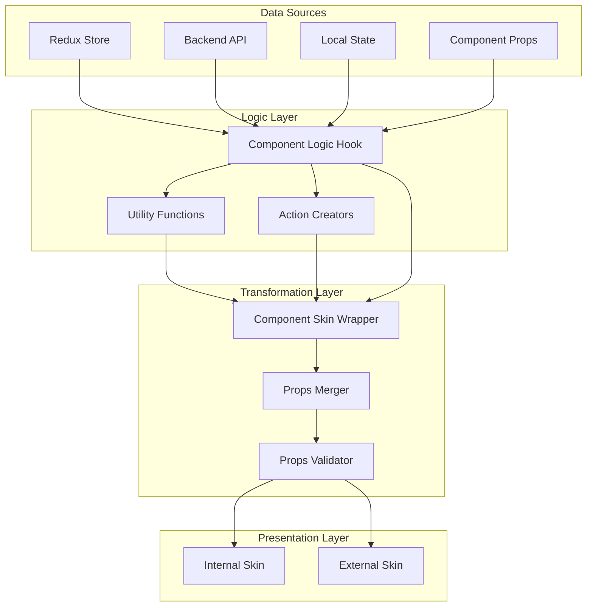

# 📊 데이터 흐름 및 Props 전달

## 📋 목차
1. [데이터 흐름 개요](#데이터-흐름-개요)
2. [컴포넌트 스킨 데이터 흐름](#컴포넌트-스킨-데이터-흐름)
3. [외부 레이아웃 스킨 데이터 흐름](#외부-레이아웃-스킨-데이터-흐름)
4. [Props 변환 과정](#props-변환-과정)
5. [상태 관리 및 동기화](#상태-관리-및-동기화)

---

## 데이터 흐름 개요

WithCookie WebBuilder의 스킨 시스템은 **단방향 데이터 흐름**을 따르며, 각 계층 간의 책임을 명확히 분리합니다.



---

## 컴포넌트 스킨 데이터 흐름

### 1. 로직 훅에서 데이터 수집

```typescript
// useLoginLogic.ts
export function useLoginLogic(componentData: ComponentData, mode: ComponentRenderMode) {
  const dispatch = useDispatch();
  const { t } = useTranslation();
  
  // 1. Redux에서 전역 상태 가져오기
  const { loading, loginSuccess, loginError, validationErrors } = useSelector(selectLoginState);
  const withcookieData = useSelector(state => state.withcookie.withcookieData);
  const isUserLoggedIn = useSelector(selectIsUserLoggedIn);
  
  // 2. 로컬 상태 관리
  const [formData, setFormData] = useState<LoginFormData>({
    user_id: "",
    password: ""
  });
  
  // 3. 컴포넌트 props에서 설정 추출
  const redirectUrl = componentData.componentProps?.redirectPath || 
                     componentData.props?.redirectPath || '/';
  
  // 4. 액션 함수들 정의
  const handleChange = useCallback((e: React.ChangeEvent<HTMLInputElement>) => {
    const { id, value } = e.target;
    setFormData(prevData => ({ ...prevData, [id]: value }));
  }, []);
  
  const handleSubmit = useCallback((e: React.FormEvent<HTMLFormElement>) => {
    e.preventDefault();
    if (mode === 'editor') return;
    dispatch(loginUser(formData));
  }, [mode, formData, dispatch]);
  
  // 5. 스킨으로 전달할 데이터 구성
  return {
    // 상태 데이터
    formData,
    validationErrors,
    loading,
    loginSuccess,
    loginError,
    theme: withcookieData?.skin?.theme?.colorset || {},
    
    // 액션 함수들
    actions: {
      handleChange,
      handleSubmit,
      handleSignupClick: () => window.location.href = '/signup'
    }
  };
}
```

### 2. ComponentSkinWrapper에서 Props 변환

```typescript
// ComponentSkinWrapper.js
const ComponentSkinWrapper = memo(function ComponentSkinWrapper({ 
  component, 
  componentData, 
  skinId,
  mode = 'preview',
  editorProps
}) {
  // 1. 컴포넌트 로직 실행
  const logicResult = component.useLogic?.(componentData, mode) || {};
  const { actions = {}, ...logicData } = logicResult;
  
  // 2. 옵션 병합 (기본값 + 사용자 설정)
  const mergedOptions = {
    ...getDefaultOptions(component),
    ...componentData?.props,
    ...componentData?.componentProps
  };
  
  // 3. 스킨 Props 구성
  const skinProps = useComponentSkinProps(
    { ...componentData, ...logicData },  // data
    mode,                                // mode
    actions,                            // actions
    mergedOptions,                      // options
    editorProps                         // editor
  );
  
  // 4. 스킨 렌더링
  if (isExternalSkin(selectedSkinId)) {
    const ExternalSkin = createExternalSkinWrapper(selectedSkinId);
    return <ExternalSkin {...skinProps} />;
  } else {
    const InternalSkin = component.internalSkins?.[selectedSkinId];
    return <InternalSkin {...skinProps} />;
  }
});
```

### 3. useComponentSkinProps에서 최종 Props 생성

```typescript
// useComponentSkinProps 훅
function useComponentSkinProps(componentData, mode, actions, options, editorProps) {
  const navigate = useNavigate();
  const { t } = useTranslation();
  
  // 전역 상태 가져오기
  const user = useSelector(selectUser);
  const currentLanguage = useSelector(selectCurrentLanguage);
  const company = useSelector(state => state.withcookie?.withcookieData?.skin?.company);
  
  // 유틸리티 함수들 준비
  const utils = {
    t,                                    // 번역 함수
    navigate,                            // 페이지 이동
    formatCurrency: (amount, currency = 'KRW') => new Intl.NumberFormat('ko-KR', {
      style: 'currency', currency
    }).format(amount),
    formatDate: (date, format = 'YYYY-MM-DD') => formatDateString(date, format),
    getAssetUrl: (path) => process.env.PUBLIC_URL + path,
    cx: (...classes) => classNames(...classes)  // 클래스명 조합
  };
  
  // 최종 Props 객체 구성
  return {
    data: componentData,      // 컴포넌트 데이터 + 로직 결과
    actions: actions || {},   // 액션 함수들
    options: options || {},   // 사용자 설정 옵션
    mode,                     // 렌더링 모드
    utils,                    // 유틸리티 함수들
    app: {                    // 전역 앱 데이터
      user,
      company,
      currentLanguage,
      isUserLoggedIn: !!user,
      theme: company?.theme
    },
    ...(mode === 'editor' && editorProps && { editor: editorProps })
  };
}
```

---

## 외부 레이아웃 스킨 데이터 흐름

### 1. ExternalLayoutWrapper에서 전역 데이터 수집

```typescript
// ExternalLayoutWrapper.js
const ExternalLayoutWrapper = ({ layoutId, children, ...layoutProps }) => {
  const dispatch = useDispatch();
  const navigate = useNavigate();
  const { t } = useTranslation();
  
  // 1. Redux에서 모든 전역 상태 가져오기
  const user = useSelector(selectUser);
  const company = useSelector(selectCompany);
  const withcookieData = useSelector(selectWithcookieData);
  const menus = useSelector(selectMenus);
  const cartItems = useSelector(selectCartItems);
  const assetBalances = useSelector(selectAssetBalances);
  const transactions = useSelector(selectTransactions);
  const isUserLoggedIn = useSelector(selectIsUserLoggedIn);
  const isAdminLoggedIn = useSelector(selectIsAdminLoggedIn);
  const currentLanguage = useSelector(selectCurrentLanguage);
  const translations = useSelector(selectTranslations);
  
  // 2. 액션 함수들 준비
  const actions = {
    // 인증 관련
    onLogin: useCallback(async (credentials) => {
      return dispatch(loginUser(credentials));
    }, [dispatch]),
    
    onLogout: useCallback(() => {
      dispatch(logoutUser());
    }, [dispatch]),
    
    onCheckAuth: useCallback(async () => {
      return dispatch(checkAuthStatus());
    }, [dispatch]),
    
    // 데이터 fetching
    onFetchBalances: useCallback(async () => {
      return dispatch(fetchAssetBalances());
    }, [dispatch]),
    
    onFetchTransactions: useCallback(async (params) => {
      return dispatch(fetchTransactions(params));
    }, [dispatch]),
    
    // 상태 업데이트
    onUpdateCart: useCallback((item) => {
      dispatch(updateCartItem(item));
    }, [dispatch]),
    
    onChangeLanguage: useCallback((lang) => {
      dispatch(changeLanguage(lang));
    }, [dispatch])
  };
  
  // 3. 유틸리티 함수들
  const utils = {
    navigate,
    location: {
      pathname: window.location.pathname,
      search: window.location.search,
      hash: window.location.hash,
      state: window.history.state
    },
    params: useParams(),
    t,
    formatCurrency: (amount, currency) => formatCurrency(amount, currency),
    formatDate: (date, format) => formatDate(date, format)
  };
  
  // 4. 레이아웃 설정
  const layout = {
    children,                           // 📍 핵심: 페이지 컨텐츠
    currentMenuId: getCurrentMenuId(),
    breadcrumbs: generateBreadcrumbs(),
    pageTitle: getPageTitle(),
    showHeader: layoutProps.showHeader !== false,
    showFooter: layoutProps.showFooter !== false,
    showSidebar: layoutProps.showSidebar || false,
    containerClass: layoutProps.containerClass || '',
    contentClass: layoutProps.contentClass || ''
  };
  
  // 5. 테마 설정
  const theme = {
    primaryColor: withcookieData?.skin?.theme?.colorset?.primary,
    secondaryColor: withcookieData?.skin?.theme?.colorset?.secondary,
    // ... 기타 테마 설정
  };
  
  // 6. 최종 Props 구성
  const externalSkinProps: ExternalSkinProps = {
    data: {
      user,
      company,
      withcookieData,
      menus,
      globalMenus: menus.filter(m => m.type === 'global'),
      mainMenus: menus.filter(m => m.type === 'main'),
      assetBalances,
      transactions,
      cartItems,
      isUserLoggedIn,
      isAdminLoggedIn,
      currentLanguage,
      translations
    },
    actions,
    utils,
    layout,
    theme
  };
  
  return <ExternalSkinComponent {...externalSkinProps} />;
};
```

---

## Props 변환 과정

### 1. 타입 안전성 보장

```typescript
// 런타임 타입 검증
const validateSkinProps = (props: any): props is ComponentSkinProps => {
  const required = ['data', 'actions', 'options', 'mode', 'utils'];
  return required.every(key => key in props);
};

// Props 전달 전 검증
if (!validateSkinProps(skinProps)) {
  console.error('Invalid skin props:', skinProps);
  return <FallbackSkin />;
}
```

### 2. 기본값 처리

```typescript
// 기본값 병합 함수
const mergeWithDefaults = (userOptions: any, componentOptions: ComponentOption[]) => {
  const defaults = {};
  
  componentOptions.forEach(option => {
    if (option.default !== undefined) {
      defaults[option.name] = option.default;
    }
  });
  
  return {
    ...defaults,           // 컴포넌트 기본값
    ...userOptions        // 사용자 설정값 (우선순위 높음)
  };
};
```

### 3. 에러 경계 처리

```typescript
// Props 전달 중 에러 처리
const SafeSkinWrapper = ({ skinComponent: SkinComponent, ...props }) => {
  return (
    <ErrorBoundary
      fallback={<FallbackSkin {...props} />}
      onError={(error, errorInfo) => {
        console.error('Skin rendering error:', error);
        // 에러 리포팅 시스템에 전송
        reportError(error, { context: 'skin-rendering', props });
      }}
    >
      <SkinComponent {...props} />
    </ErrorBoundary>
  );
};
```

---

## 상태 관리 및 동기화

### 1. Redux 상태와 스킨 동기화

```typescript
// 상태 변경 감지 및 스킨 업데이트
const useSkinStateSync = (skinId: string) => {
  const prevState = useRef();
  
  // 관련 상태들 구독
  const relevantState = useSelector(state => ({
    user: state.user,
    theme: state.withcookie.withcookieData?.skin?.theme,
    language: state.language.current
  }));
  
  useEffect(() => {
    // 상태가 변경되면 스킨에 알림
    if (prevState.current && !isEqual(prevState.current, relevantState)) {
      notifySkinStateChange(skinId, relevantState);
    }
    prevState.current = relevantState;
  }, [relevantState, skinId]);
};
```

### 2. 실시간 Props 업데이트

```typescript
// Props 변경 감지 및 리렌더링 최적화
const MemoizedSkinWrapper = memo(({ 
  skinComponent: SkinComponent, 
  ...props 
}) => {
  return <SkinComponent {...props} />;
}, (prevProps, nextProps) => {
  // 얕은 비교로 불필요한 리렌더링 방지
  const keysToCompare = ['data', 'options', 'mode'];
  
  return keysToCompare.every(key => 
    shallowEqual(prevProps[key], nextProps[key])
  );
});
```

### 3. 비동기 데이터 처리

```typescript
// 비동기 데이터 로딩 상태 관리
const useAsyncSkinData = (dataFetchers: Function[]) => {
  const [loadingStates, setLoadingStates] = useState({});
  const [errors, setErrors] = useState({});
  
  const fetchData = useCallback(async (fetcherName: string, fetcher: Function) => {
    setLoadingStates(prev => ({ ...prev, [fetcherName]: true }));
    
    try {
      const result = await fetcher();
      setErrors(prev => ({ ...prev, [fetcherName]: null }));
      return result;
    } catch (error) {
      setErrors(prev => ({ ...prev, [fetcherName]: error }));
      throw error;
    } finally {
      setLoadingStates(prev => ({ ...prev, [fetcherName]: false }));
    }
  }, []);
  
  return { fetchData, loadingStates, errors };
};
```

---

## 성능 최적화

### 1. Props 메모이제이션

```typescript
// 비용이 큰 Props 계산 최적화
const useMemoizedSkinProps = (baseProps: any) => {
  return useMemo(() => {
    return {
      ...baseProps,
      utils: {
        ...baseProps.utils,
        // 함수들을 메모이제이션
        formatCurrency: memoize(formatCurrency),
        formatDate: memoize(formatDate),
        getAssetUrl: memoize(getAssetUrl)
      }
    };
  }, [baseProps]);
};
```

### 2. 조건부 데이터 로딩

```typescript
// 스킨에서 실제로 사용하는 데이터만 로딩
const useConditionalData = (skinRequirements: string[]) => {
  const data = {};
  
  if (skinRequirements.includes('user')) {
    data.user = useSelector(selectUser);
  }
  
  if (skinRequirements.includes('cart')) {
    data.cartItems = useSelector(selectCartItems);
  }
  
  // 필요한 데이터만 선택적으로 포함
  return data;
};
```

### 3. 배치 업데이트

```typescript
// 여러 상태 변경을 배치로 처리
const useBatchedSkinUpdates = () => {
  const [pendingUpdates, setPendingUpdates] = useState([]);
  
  const addUpdate = useCallback((update) => {
    setPendingUpdates(prev => [...prev, update]);
  }, []);
  
  useEffect(() => {
    if (pendingUpdates.length > 0) {
      // React의 자동 배치 활용
      unstable_batchedUpdates(() => {
        pendingUpdates.forEach(update => update());
      });
      setPendingUpdates([]);
    }
  }, [pendingUpdates]);
  
  return { addUpdate };
};
```

---

## 데이터 흐름 디버깅

### 1. Props 추적

```typescript
// 개발 모드에서 Props 변화 추적
const usePropsTracker = (props: any, componentName: string) => {
  const prevProps = useRef(props);
  
  useEffect(() => {
    if (process.env.NODE_ENV === 'development') {
      const changes = findChanges(prevProps.current, props);
      if (changes.length > 0) {
        console.group(`🔄 ${componentName} Props Changed`);
        changes.forEach(change => {
          console.log(`${change.path}: ${change.from} → ${change.to}`);
        });
        console.groupEnd();
      }
    }
    prevProps.current = props;
  }, [props, componentName]);
};
```

### 2. 데이터 흐름 시각화

```typescript
// 데이터 흐름을 콘솔에서 시각화
const visualizeDataFlow = (source: string, target: string, data: any) => {
  if (process.env.NODE_ENV === 'development') {
    console.log(`📊 ${source} → ${target}:`, {
      timestamp: new Date().toISOString(),
      dataKeys: Object.keys(data),
      dataSize: JSON.stringify(data).length,
      preview: typeof data === 'object' ? Object.keys(data).slice(0, 5) : data
    });
  }
};
```

---

## 다음 단계

1. ⚡ **[로딩 메커니즘](./loading-mechanism.md)** - 외부 스킨 동적 로딩 과정
2. 🔒 **[보안 및 성능](./security-performance.md)** - 운영 환경 고려사항

---

> **💡 핵심 포인트**: 데이터 흐름의 명확한 분리와 타입 안전성을 통해 예측 가능하고 디버깅하기 쉬운 시스템을 구축했습니다. 각 계층은 단일 책임을 가지며, Props는 변환 과정을 거쳐 스킨에 최적화된 형태로 전달됩니다.