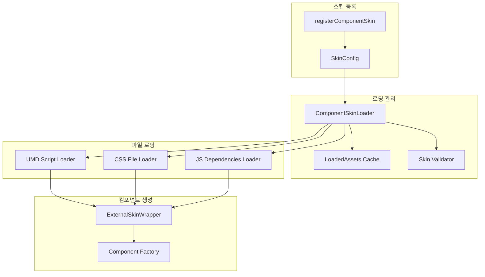
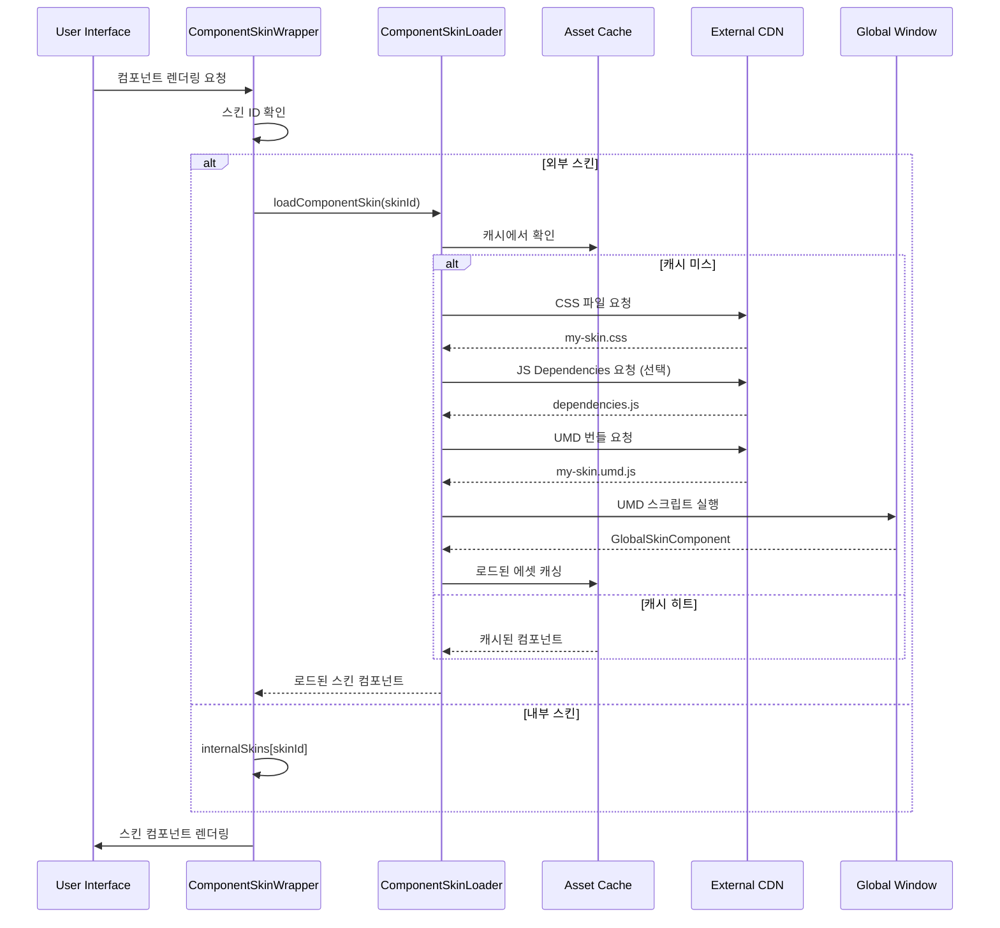

# ⚡ 외부 스킨 로딩 메커니즘

## 📋 목차
1. [로딩 시스템 개요](#로딩-시스템-개요)
2. [동적 로딩 프로세스](#동적-로딩-프로세스)
3. [캐싱 전략](#캐싱-전략)
4. [에러 처리 및 폴백](#에러-처리-및-폴백)
5. [성능 최적화](#성능-최적화)

---

## 로딩 시스템 개요

WithCookie WebBuilder의 외부 스킨 로딩 시스템은 **런타임 동적 로딩**을 통해 필요한 시점에만 스킨을 가져와 성능을 최적화합니다.

### 핵심 구성 요소



---

## 동적 로딩 프로세스

### 1. 스킨 등록 단계

```typescript
// 스킨 등록 - 실제 로딩은 하지 않고 메타데이터만 저장
export function registerComponentSkin(config: ComponentSkinConfig) {
  // 필수 필드 검증
  if (!config.id || !config.umdUrl || !config.globalName || !config.componentTypes) {
    throw new Error('필수 스킨 설정이 누락되었습니다');
  }
  
  // 스킨 설정을 메모리에 저장 (실제 파일은 로드하지 않음)
  componentSkins.set(config.id, {
    ...config,
    loaded: false,      // 아직 로드되지 않음
    loading: false,     // 로딩 중이 아님
    component: null,    // 컴포넌트는 나중에 로드
    error: null
  });
  
  // 컴포넌트 타입별 스킨 매핑
  config.componentTypes.forEach(componentType => {
    if (!componentTypeSkins.has(componentType)) {
      componentTypeSkins.set(componentType, new Set());
    }
    componentTypeSkins.get(componentType).add(config.id);
  });
  
  console.log(`✅ 스킨 "${config.name}" 등록 완료 (실제 로드는 필요시 수행)`);
}
```

### 2. 온디맨드 로딩 시퀀스



### 3. 상세 로딩 구현

```typescript
// ComponentSkinLoader.js의 핵심 로딩 함수
export async function loadComponentSkin(skinId: string): Promise<React.ComponentType> {
  const config = componentSkins.get(skinId);
  
  if (!config) {
    throw new Error(`스킨 "${skinId}"을 찾을 수 없습니다`);
  }
  
  // 이미 로드된 경우 캐시된 컴포넌트 반환
  if (config.loaded && config.component) {
    console.log(`📦 캐시에서 스킨 로드: ${config.name}`);
    return config.component;
  }
  
  // 동시 로딩 방지
  if (config.loading) {
    return waitForLoading(config);
  }
  
  config.loading = true;
  console.log(`🔄 스킨 로딩 시작: ${config.name}`);
  
  try {
    // 1단계: CSS 파일들 병렬 로딩
    if (config.cssUrls && config.cssUrls.length > 0) {
      await Promise.all(
        config.cssUrls.map(url => loadCssFile(url))
      );
      console.log(`✅ CSS 로딩 완료: ${config.cssUrls.length}개 파일`);
    }
    
    // 2단계: JS 의존성 파일들 순차 로딩
    if (config.jsUrls && config.jsUrls.length > 0) {
      for (const url of config.jsUrls) {
        await loadJsFile(url);
      }
      console.log(`✅ JS 의존성 로딩 완료: ${config.jsUrls.length}개 파일`);
    }
    
    // 3단계: 메인 UMD 번들 로딩
    const Component = await loadUMDScript(config.umdUrl, config.globalName);
    console.log(`✅ UMD 번들 로딩 완료: ${config.globalName}`);
    
    // 4단계: 컴포넌트 검증
    if (typeof Component !== 'function') {
      throw new Error(`유효하지 않은 스킨 컴포넌트: ${config.globalName}`);
    }
    
    // 5단계: 로딩 상태 업데이트
    config.component = Component;
    config.loaded = true;
    config.loading = false;
    config.error = null;
    
    console.log(`🎉 스킨 로딩 성공: ${config.name}`);
    return Component;
    
  } catch (error) {
    config.error = error;
    config.loading = false;
    console.error(`❌ 스킨 로딩 실패: ${config.name}`, error);
    throw error;
  }
}
```

### 4. 파일별 로딩 함수

#### CSS 파일 로딩

```typescript
async function loadCssFile(url: string): Promise<void> {
  // 중복 로딩 방지
  if (loadedAssets.css.has(url)) {
    return;
  }
  
  return new Promise((resolve, reject) => {
    const link = document.createElement('link');
    link.rel = 'stylesheet';
    link.href = url;
    link.crossOrigin = 'anonymous';
    
    link.onload = () => {
      loadedAssets.css.add(url);
      console.log(`📄 CSS 로드 완료: ${url}`);
      resolve();
    };
    
    link.onerror = (error) => {
      console.warn(`⚠️ CSS 로드 실패 (계속 진행): ${url}`, error);
      // CSS 실패는 치명적이지 않으므로 계속 진행
      loadedAssets.css.add(url);
      resolve();
    };
    
    document.head.appendChild(link);
  });
}
```

#### UMD 스크립트 로딩

```typescript
async function loadUMDScript(url: string, globalName: string): Promise<React.ComponentType> {
  // React와 ReactDOM을 전역에서 사용할 수 있도록 보장
  if (!window.React) {
    window.React = React;
  }
  if (!window.ReactDOM) {
    window.ReactDOM = ReactDOM;
  }
  
  // 이미 로드된 경우 전역 변수에서 가져오기
  if (window[globalName]) {
    return window[globalName];
  }
  
  // 동시 로딩 방지
  if (loadedAssets.umd.has(url)) {
    return waitForGlobalVariable(globalName);
  }
  
  loadedAssets.umd.add(url);
  
  return new Promise((resolve, reject) => {
    const script = document.createElement('script');
    script.src = url;
    script.crossOrigin = 'anonymous';
    script.async = true;
    
    script.onload = () => {
      // 스크립트 로드 후 잠시 대기 (전역 변수 설정 시간 확보)
      setTimeout(() => {
        if (window[globalName]) {
          const Component = window[globalName];
          // default export 처리
          const ActualComponent = Component.default || Component;
          console.log(`📦 UMD 컴포넌트 로드 완료: ${globalName}`);
          resolve(ActualComponent);
        } else {
          reject(new Error(`전역 변수 ${globalName}을 찾을 수 없습니다`));
        }
      }, 100);
    };
    
    script.onerror = (event) => {
      loadedAssets.umd.delete(url);
      console.error(`❌ UMD 스크립트 로드 실패: ${url}`, event);
      reject(new Error(`UMD 스크립트 로드 실패: ${url}`));
    };
    
    document.body.appendChild(script);
  });
}
```

---

## 캐싱 전략

### 1. 메모리 캐싱

```typescript
// 다층 캐싱 시스템
const cachingSystem = {
  // Level 1: 로드된 에셋 URL 추적
  loadedAssets: {
    css: new Set<string>(),
    js: new Set<string>(),
    umd: new Set<string>()
  },
  
  // Level 2: 컴포넌트 인스턴스 캐싱
  componentCache: new Map<string, React.ComponentType>(),
  
  // Level 3: 래퍼 컴포넌트 캐싱
  wrapperCache: new Map<string, React.ComponentType>(),
  
  // 캐시 통계
  stats: {
    hits: 0,
    misses: 0,
    errors: 0
  }
};

// 캐시 히트율 모니터링
export function getCacheStats() {
  const total = cachingSystem.stats.hits + cachingSystem.stats.misses;
  return {
    ...cachingSystem.stats,
    hitRate: total > 0 ? (cachingSystem.stats.hits / total * 100).toFixed(2) + '%' : '0%'
  };
}
```

### 2. 브라우저 캐싱 최적화

```typescript
// 로딩 시 캐시 최적화 헤더 활용
const optimizedLoading = {
  // 적절한 캐시 헤더 설정 권장
  recommendedHeaders: {
    'Cache-Control': 'public, max-age=31536000, immutable',  // 1년 캐싱
    'ETag': 'W/"skin-version-hash"',                         // 버전 기반 캐시 무효화
    'Vary': 'Accept-Encoding'                                // 압축 옵션별 캐싱
  },
  
  // 캐시 무효화 전략
  cacheBreaking: {
    // 버전 기반: my-skin.v1.2.3.umd.js
    versionBased: (url: string, version: string) => 
      url.replace('.umd.js', `.v${version}.umd.js`),
    
    // 해시 기반: my-skin.abc123.umd.js
    hashBased: (url: string, hash: string) => 
      url.replace('.umd.js', `.${hash}.umd.js`),
    
    // 쿼리 파라미터: my-skin.umd.js?v=1.2.3
    queryBased: (url: string, version: string) => 
      `${url}?v=${version}`
  }
};
```

### 3. Service Worker 캐싱 (선택적)

```typescript
// Service Worker를 활용한 고급 캐싱
const serviceWorkerCaching = `
// sw.js
const SKIN_CACHE_NAME = 'withcookie-skins-v1';
const SKIN_URLS = [
  // 자주 사용되는 스킨들을 프리캐시
  '/skins/basic-login.umd.js',
  '/skins/modern-layout.umd.js'
];

// 설치 시 프리캐시
self.addEventListener('install', (event) => {
  event.waitUntil(
    caches.open(SKIN_CACHE_NAME)
      .then(cache => cache.addAll(SKIN_URLS))
  );
});

// 런타임 캐싱 전략
self.addEventListener('fetch', (event) => {
  if (event.request.url.includes('.umd.js') || 
      event.request.url.includes('skin')) {
    event.respondWith(
      caches.match(event.request)
        .then(response => {
          // 캐시에서 발견되면 반환, 아니면 네트워크 요청
          return response || fetch(event.request)
            .then(fetchResponse => {
              // 성공적인 응답을 캐시에 저장
              const responseClone = fetchResponse.clone();
              caches.open(SKIN_CACHE_NAME)
                .then(cache => cache.put(event.request, responseClone));
              return fetchResponse;
            });
        })
    );
  }
});
`;
```

---

## 에러 처리 및 폴백

### 1. 다단계 폴백 시스템

```typescript
// 에러 처리 및 폴백 전략
export function createExternalSkinWrapper(skinId: string) {
  const ExternalSkinWrapper = memo(function ExternalSkinWrapper(props) {
    const [SkinComponent, setSkinComponent] = useState(null);
    const [error, setError] = useState(null);
    const [loading, setLoading] = useState(true);
    const [retryCount, setRetryCount] = useState(0);
    
    const MAX_RETRIES = 3;
    const RETRY_DELAYS = [1000, 2000, 5000]; // 지수 백오프
    
    const loadSkin = useCallback(async (attempt = 0) => {
      try {
        console.log(`🔄 스킨 로딩 시도 ${attempt + 1}/${MAX_RETRIES + 1}: ${skinId}`);
        const LoadedComponent = await loadComponentSkin(skinId);
        const MemoizedComponent = memo(LoadedComponent);
        setSkinComponent(() => MemoizedComponent);
        setError(null);
        setLoading(false);
        
      } catch (err) {
        console.error(`❌ 스킨 로딩 실패 (시도 ${attempt + 1}):`, err);
        
        if (attempt < MAX_RETRIES) {
          // 재시도 로직
          const delay = RETRY_DELAYS[attempt] || 5000;
          console.log(`⏰ ${delay}ms 후 재시도...`);
          
          setTimeout(() => {
            setRetryCount(attempt + 1);
            loadSkin(attempt + 1);
          }, delay);
          
        } else {
          // 최대 재시도 초과 시 폴백
          console.error('💥 스킨 로딩 최종 실패, 폴백 모드로 전환');
          setError(err);
          setLoading(false);
          
          // 에러 리포팅
          reportSkinLoadError(skinId, err, attempt + 1);
        }
      }
    }, [skinId]);
    
    useEffect(() => {
      loadSkin();
    }, [loadSkin]);
    
    // 로딩 상태
    if (loading) {
      return <SkinLoadingFallback retryCount={retryCount} />;
    }
    
    // 에러 상태 - 폴백 UI 표시
    if (error) {
      return <SkinErrorFallback 
        error={error} 
        skinId={skinId}
        onRetry={() => loadSkin(0)}
        {...props} 
      />;
    }
    
    // 정상 로딩 완료
    return <SkinComponent {...props} />;
  });
  
  return ExternalSkinWrapper;
}
```

### 2. 폴백 컴포넌트들

```typescript
// 로딩 상태 폴백
const SkinLoadingFallback = ({ retryCount }) => (
  <div style={{
    padding: '20px',
    textAlign: 'center',
    background: '#f8f9fa',
    borderRadius: '8px',
    border: '1px dashed #dee2e6'
  }}>
    <div style={{ marginBottom: '10px' }}>
      <div className="loading-spinner" />
    </div>
    <div>스킨 로딩 중...</div>
    {retryCount > 0 && (
      <div style={{ fontSize: '12px', color: '#6c757d', marginTop: '5px' }}>
        재시도 중 ({retryCount}/3)
      </div>
    )}
  </div>
);

// 에러 상태 폴백
const SkinErrorFallback = ({ error, skinId, onRetry, ...props }) => (
  <div style={{
    padding: '20px',
    background: '#fee',
    border: '1px solid #fcc',
    borderRadius: '8px',
    color: '#c00'
  }}>
    <div style={{ fontWeight: 'bold', marginBottom: '10px' }}>
      ⚠️ 스킨 로드 실패
    </div>
    <div style={{ fontSize: '14px', marginBottom: '15px' }}>
      <div>스킨 ID: {skinId}</div>
      <div>오류: {error.message}</div>
    </div>
    <div style={{ display: 'flex', gap: '10px' }}>
      <button 
        onClick={onRetry}
        style={{
          padding: '8px 16px',
          background: '#dc3545',
          color: 'white',
          border: 'none',
          borderRadius: '4px',
          cursor: 'pointer'
        }}
      >
        다시 시도
      </button>
      <button 
        onClick={() => window.location.reload()}
        style={{
          padding: '8px 16px',
          background: '#6c757d',
          color: 'white',
          border: 'none',
          borderRadius: '4px',
          cursor: 'pointer'
        }}
      >
        페이지 새로고침
      </button>
    </div>
  </div>
);
```

### 3. 에러 리포팅 시스템

```typescript
// 에러 수집 및 분석
const reportSkinLoadError = (skinId: string, error: Error, attempts: number) => {
  const errorReport = {
    skinId,
    error: {
      message: error.message,
      stack: error.stack,
      name: error.name
    },
    attempts,
    timestamp: new Date().toISOString(),
    userAgent: navigator.userAgent,
    url: window.location.href,
    // 네트워크 상태 등 추가 컨텍스트
    online: navigator.onLine,
    connection: (navigator as any).connection?.effectiveType
  };
  
  // 에러 리포팅 서비스에 전송
  if (typeof window.reportError === 'function') {
    window.reportError(errorReport);
  }
  
  // 개발 환경에서는 콘솔에 자세한 정보 출력
  if (process.env.NODE_ENV === 'development') {
    console.group('🚨 스킨 로딩 에러 리포트');
    console.table(errorReport);
    console.groupEnd();
  }
};
```

---

## 성능 최적화

### 1. 프리로딩 전략

```typescript
// 자주 사용되는 스킨 프리로딩
export class SkinPreloader {
  private preloadQueue: string[] = [];
  private preloading = new Set<string>();
  private maxConcurrent = 2; // 동시 프리로딩 제한
  
  // 프리로딩 대상 추가
  public addToPreload(skinId: string, priority: 'high' | 'low' = 'low') {
    if (priority === 'high') {
      this.preloadQueue.unshift(skinId);
    } else {
      this.preloadQueue.push(skinId);
    }
    this.processQueue();
  }
  
  // 프리로딩 큐 처리
  private async processQueue() {
    if (this.preloading.size >= this.maxConcurrent || this.preloadQueue.length === 0) {
      return;
    }
    
    const skinId = this.preloadQueue.shift();
    if (!skinId || this.preloading.has(skinId)) {
      return;
    }
    
    this.preloading.add(skinId);
    
    try {
      // 백그라운드에서 프리로딩 (에러는 무시)
      await loadComponentSkin(skinId);
      console.log(`✅ 프리로딩 완료: ${skinId}`);
    } catch (error) {
      console.warn(`⚠️ 프리로딩 실패 (무시): ${skinId}`, error);
    } finally {
      this.preloading.delete(skinId);
      // 다음 큐 아이템 처리
      setTimeout(() => this.processQueue(), 100);
    }
  }
  
  // 사용 통계 기반 자동 프리로딩
  public enableSmartPreloading() {
    // 페이지 방문 패턴 분석
    const visitedPages = JSON.parse(localStorage.getItem('visitedPages') || '[]');
    const frequentSkins = this.analyzeFrequentSkins(visitedPages);
    
    // 자주 사용되는 스킨 프리로딩
    frequentSkins.forEach(skinId => {
      this.addToPreload(skinId, 'high');
    });
  }
  
  private analyzeFrequentSkins(pages: string[]): string[] {
    // 방문 빈도 분석 로직
    const skinUsage = new Map<string, number>();
    
    pages.forEach(page => {
      const skins = this.getSkinsUsedInPage(page);
      skins.forEach(skinId => {
        skinUsage.set(skinId, (skinUsage.get(skinId) || 0) + 1);
      });
    });
    
    // 사용 빈도 순으로 정렬
    return Array.from(skinUsage.entries())
      .sort(([, a], [, b]) => b - a)
      .slice(0, 5) // 상위 5개
      .map(([skinId]) => skinId);
  }
}

// 전역 프리로더 인스턴스
export const skinPreloader = new SkinPreloader();
```

### 2. 번들 크기 최적화

```typescript
// 스킨 번들 크기 분석 및 최적화
export const bundleOptimization = {
  // 번들 크기 체크
  checkBundleSize: async (skinId: string) => {
    const config = componentSkins.get(skinId);
    if (!config) return null;
    
    const sizes = await Promise.all([
      fetch(config.umdUrl, { method: 'HEAD' })
        .then(res => ({
          type: 'umd',
          size: parseInt(res.headers.get('content-length') || '0')
        })),
      
      ...(config.cssUrls?.map(url => 
        fetch(url, { method: 'HEAD' })
          .then(res => ({
            type: 'css',
            url,
            size: parseInt(res.headers.get('content-length') || '0')
          }))
      ) || [])
    ]);
    
    const totalSize = sizes.reduce((sum, { size }) => sum + size, 0);
    
    return {
      skinId,
      totalSize,
      formattedSize: formatBytes(totalSize),
      breakdown: sizes
    };
  },
  
  // 크기 기반 로딩 전략
  loadBySize: async (skinId: string) => {
    const sizeInfo = await bundleOptimization.checkBundleSize(skinId);
    
    if (sizeInfo && sizeInfo.totalSize > 500 * 1024) { // 500KB 이상
      console.warn(`⚠️ 큰 스킨 번들 감지: ${sizeInfo.formattedSize}`);
      
      // 큰 번들의 경우 사용자에게 로딩 진행률 표시
      return loadWithProgress(skinId);
    }
    
    return loadComponentSkin(skinId);
  }
};

const formatBytes = (bytes: number): string => {
  if (bytes === 0) return '0 Bytes';
  const k = 1024;
  const sizes = ['Bytes', 'KB', 'MB', 'GB'];
  const i = Math.floor(Math.log(bytes) / Math.log(k));
  return parseFloat((bytes / Math.pow(k, i)).toFixed(2)) + ' ' + sizes[i];
};
```

### 3. 로딩 진행률 표시

```typescript
// 큰 번들의 경우 진행률 표시와 함께 로딩
const loadWithProgress = async (skinId: string): Promise<React.ComponentType> => {
  const config = componentSkins.get(skinId);
  if (!config) throw new Error(`스킨을 찾을 수 없습니다: ${skinId}`);
  
  // 진행률 이벤트 발생기
  const progressEmitter = new EventTarget();
  
  // 진행률 UI 표시
  const showProgressUI = () => {
    const progressDiv = document.createElement('div');
    progressDiv.id = `skin-loading-${skinId}`;
    progressDiv.innerHTML = `
      <div style="position: fixed; top: 50%; left: 50%; transform: translate(-50%, -50%); 
                  background: white; padding: 20px; border-radius: 8px; box-shadow: 0 4px 12px rgba(0,0,0,0.15); z-index: 10000;">
        <div>스킨 로딩 중...</div>
        <div style="width: 200px; height: 4px; background: #eee; border-radius: 2px; margin: 10px 0;">
          <div id="progress-bar" style="width: 0%; height: 100%; background: #007bff; border-radius: 2px; transition: width 0.3s;"></div>
        </div>
        <div id="progress-text">0%</div>
      </div>
    `;
    document.body.appendChild(progressDiv);
    
    progressEmitter.addEventListener('progress', (event: any) => {
      const { loaded, total } = event.detail;
      const percent = Math.round((loaded / total) * 100);
      
      const progressBar = document.getElementById('progress-bar');
      const progressText = document.getElementById('progress-text');
      
      if (progressBar && progressText) {
        progressBar.style.width = `${percent}%`;
        progressText.textContent = `${percent}%`;
      }
    });
    
    return () => {
      const element = document.getElementById(`skin-loading-${skinId}`);
      if (element) {
        element.remove();
      }
    };
  };
  
  const hideProgressUI = showProgressUI();
  
  try {
    // 진행률과 함께 로딩
    const component = await loadComponentSkinWithProgress(config, progressEmitter);
    return component;
  } finally {
    hideProgressUI();
  }
};

const loadComponentSkinWithProgress = async (
  config: any, 
  progressEmitter: EventTarget
): Promise<React.ComponentType> => {
  let totalSteps = 1; // UMD 번들
  if (config.cssUrls) totalSteps += config.cssUrls.length;
  if (config.jsUrls) totalSteps += config.jsUrls.length;
  
  let completedSteps = 0;
  
  const updateProgress = () => {
    progressEmitter.dispatchEvent(new CustomEvent('progress', {
      detail: { loaded: completedSteps, total: totalSteps }
    }));
  };
  
  // CSS 파일들 로딩
  if (config.cssUrls) {
    for (const url of config.cssUrls) {
      await loadCssFile(url);
      completedSteps++;
      updateProgress();
    }
  }
  
  // JS 의존성 로딩
  if (config.jsUrls) {
    for (const url of config.jsUrls) {
      await loadJsFile(url);
      completedSteps++;
      updateProgress();
    }
  }
  
  // UMD 번들 로딩
  const component = await loadUMDScript(config.umdUrl, config.globalName);
  completedSteps++;
  updateProgress();
  
  return component;
};
```

---

## 모니터링 및 분석

### 1. 로딩 성능 메트릭

```typescript
// 성능 메트릭 수집
export class SkinLoadingMetrics {
  private metrics = new Map<string, any>();
  
  public startLoading(skinId: string) {
    this.metrics.set(skinId, {
      startTime: performance.now(),
      skinId,
      steps: []
    });
  }
  
  public recordStep(skinId: string, step: string, success: boolean) {
    const metric = this.metrics.get(skinId);
    if (metric) {
      metric.steps.push({
        step,
        success,
        timestamp: performance.now() - metric.startTime
      });
    }
  }
  
  public endLoading(skinId: string, success: boolean) {
    const metric = this.metrics.get(skinId);
    if (metric) {
      metric.endTime = performance.now();
      metric.totalTime = metric.endTime - metric.startTime;
      metric.success = success;
      
      // 분석 서버로 전송
      this.sendMetrics(metric);
    }
  }
  
  private sendMetrics(metric: any) {
    if (process.env.NODE_ENV === 'production') {
      // 실제 분석 서비스로 전송
      fetch('/api/skin-metrics', {
        method: 'POST',
        headers: { 'Content-Type': 'application/json' },
        body: JSON.stringify(metric)
      }).catch(err => console.warn('메트릭 전송 실패:', err));
    } else {
      // 개발 환경에서는 콘솔에 출력
      console.table(metric);
    }
  }
}

export const skinMetrics = new SkinLoadingMetrics();
```

### 2. 자동 성능 최적화

```typescript
// 로딩 패턴 학습 및 자동 최적화
export class AdaptiveLoadingOptimizer {
  private loadingHistory: Array<{
    skinId: string;
    loadTime: number;
    success: boolean;
    timestamp: number;
  }> = [];
  
  // 로딩 완료 시 기록
  public recordLoading(skinId: string, loadTime: number, success: boolean) {
    this.loadingHistory.push({
      skinId,
      loadTime,
      success,
      timestamp: Date.now()
    });
    
    // 최근 100개 기록만 유지
    if (this.loadingHistory.length > 100) {
      this.loadingHistory.shift();
    }
    
    this.optimizeBasedOnHistory();
  }
  
  // 히스토리 기반 최적화 전략 적용
  private optimizeBasedOnHistory() {
    const recentFailures = this.loadingHistory
      .filter(record => !record.success && Date.now() - record.timestamp < 5 * 60 * 1000) // 최근 5분
      .map(record => record.skinId);
    
    const slowLoaders = this.loadingHistory
      .filter(record => record.loadTime > 3000) // 3초 이상
      .map(record => record.skinId);
    
    // 자주 실패하는 스킨은 프리로딩에서 제외
    recentFailures.forEach(skinId => {
      console.warn(`⚠️ 스킨 ${skinId} 프리로딩 제외 (최근 실패)`);
      skinPreloader.removeFromPreload(skinId);
    });
    
    // 느린 스킨은 백그라운드 프리로딩
    slowLoaders.forEach(skinId => {
      console.info(`🐌 스킨 ${skinId} 백그라운드 프리로딩 예약`);
      skinPreloader.addToPreload(skinId, 'low');
    });
  }
}

export const adaptiveOptimizer = new AdaptiveLoadingOptimizer();
```

---

## 다음 단계

1. 🔒 **[보안 및 성능](./security-performance.md)** - 운영 환경 고려사항

---

> **💡 핵심 포인트**: 외부 스킨 로딩 시스템은 **성능, 안정성, 사용자 경험**을 모두 고려한 정교한 시스템입니다. 다단계 캐싱, 에러 처리, 성능 최적화를 통해 프로덕션 환경에서도 안정적으로 동작합니다.