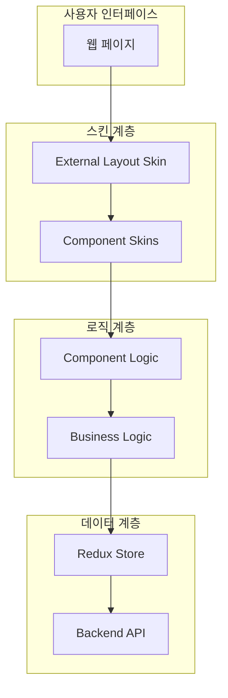
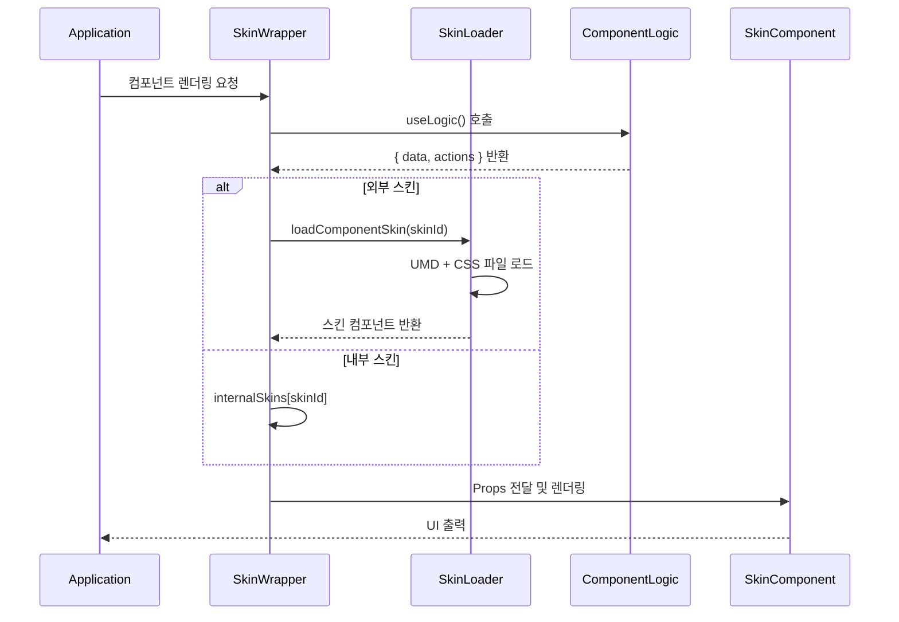
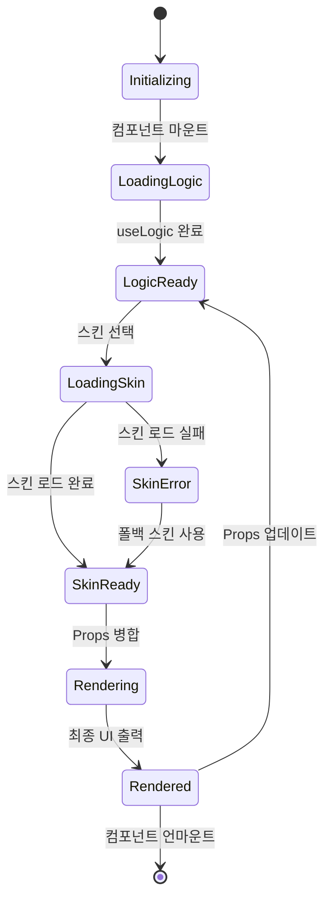

# 🏗️ 스킨 시스템 아키텍처 개요

## 📋 목차
1. [전체 시스템 구조](#전체-시스템-구조)
2. [이중 스킨 시스템](#이중-스킨-시스템)
3. [핵심 설계 원칙](#핵심-설계-원칙)
4. [컴포넌트 생명주기](#컴포넌트-생명주기)
5. [확장성 고려사항](#확장성-고려사항)

---

## 전체 시스템 구조

WithCookie WebBuilder의 스킨 시스템은 **계층화된 아키텍처**를 통해 최대의 유연성과 재사용성을 제공합니다.



### 계층별 책임

| 계층 | 담당 영역 | 변경 빈도 | 재사용성 |
|------|-----------|-----------|----------|
| **스킨 계층** | UI/UX, 디자인, 브랜딩 | 높음 | 높음 |
| **로직 계층** | 비즈니스 규칙, 상태 관리 | 중간 | 높음 |
| **데이터 계층** | API 호출, 데이터 저장 | 낮음 | 높음 |

---

## 이중 스킨 시스템

WithCookie WebBuilder는 **두 가지 레벨의 스킨**을 지원하여 완전한 커스터마이징을 가능하게 합니다.

### 1. 외부 레이아웃 스킨 (External Layout Skin)

**전체 사이트의 골격을 담당**

```typescript
interface ExternalSkinProps {
  data: {
    user: User | null;
    company: Company | null;
    withcookieData: WithcookieData;
    menus: Menu[];
    isUserLoggedIn: boolean;
    // ... 90+ 필드
  };
  actions: {
    onLogin: (credentials: LoginCredentials) => Promise<void>;
    onLogout: () => void;
    // ... 액션 함수들
  };
  utils: {
    navigate: (path: string) => void;
    t: (key: string) => string;
    // ... 유틸리티 함수들
  };
  layout: {
    children: React.ReactNode;  // 📍 핵심: 페이지 컨텐츠
    showHeader?: boolean;
    showFooter?: boolean;
    // ... 레이아웃 설정
  };
  theme?: ThemeConfiguration;
}
```

**특징:**
- 🏠 **사이트 전체** 레이아웃 관리
- 📱 **헤더, 푸터, 네비게이션** 담당
- 🎨 **브랜드 아이덴티티** 적용
- 🌐 **다국어, 테마** 시스템 통합

### 2. 컴포넌트 스킨 (Component Skin)

**개별 컴포넌트의 세부 UI를 담당**

```typescript
interface ComponentSkinProps {
  data: {
    // 컴포넌트별 특화된 데이터
    formData?: any;
    validationErrors?: any;
    loading?: boolean;
    // ...
  };
  actions: {
    // 컴포넌트별 액션 함수들
    handleSubmit?: Function;
    handleChange?: Function;
    // ...
  };
  options: {
    // 사용자 설정 가능한 옵션들
    title?: string;
    buttonColor?: string;
    // ...
  };
  mode: 'editor' | 'preview' | 'production';
  utils: UtilityFunctions;
  app?: GlobalAppData;
}
```

**특징:**
- 🧩 **개별 컴포넌트** 단위 커스터마이징
- ⚙️ **세부 설정** 옵션 제공
- 🔄 **로직 재사용** 가능
- 🎯 **특정 기능** 최적화

---

## 핵심 설계 원칙

### 1. 관심사의 분리 (Separation of Concerns)

```typescript
// ❌ 기존 방식: UI와 로직이 섞임
const LoginComponent = () => {
  const [username, setUsername] = useState('');
  const [loading, setLoading] = useState(false);
  
  const handleLogin = async () => {
    setLoading(true);
    // API 호출 로직
    // UI 업데이트 로직
  };
  
  return (
    <form onSubmit={handleLogin}>
      {/* UI 코드 */}
    </form>
  );
};

// ✅ 새로운 방식: 완전 분리
const useLoginLogic = () => {
  // 로직만 담당
  return { data, actions };
};

const LoginSkin = ({ data, actions }) => {
  // UI만 담당
  return <form onSubmit={actions.handleSubmit}>...</form>;
};
```

### 2. 의존성 역전 (Dependency Inversion)

```typescript
// 스킨이 로직에 의존하는 것이 아니라
// 로직이 스킨에 데이터를 제공
interface SkinContract {
  data: LogicOutput;
  actions: LogicActions;
}

// 로직은 스킨을 모르고, 스킨은 로직 구현을 모름
const logicOutput = useComponentLogic();
const skinComponent = getSkinComponent(skinId);
return <skinComponent {...logicOutput} />;
```

### 3. 개방-폐쇄 원칙 (Open-Closed Principle)

```typescript
// 기존 로직은 수정하지 않고 (Closed)
const loginLogic = useLoginLogic(); // 변경 없음

// 새로운 스킨으로 확장 (Open)
const newSkin = createCustomSkin({
  template: 'glassmorphism',
  brandColor: '#ff6b6b',
  animations: true
});
```

### 4. 단일 책임 원칙 (Single Responsibility)

| 컴포넌트 | 단일 책임 |
|----------|-----------|
| `useLoginLogic` | 로그인 비즈니스 로직만 |
| `BasicLoginSkin` | 기본 로그인 UI만 |
| `ComponentSkinWrapper` | 스킨 로딩 및 Props 전달만 |
| `ComponentSkinLoader` | 외부 스킨 파일 로딩만 |

---

## 컴포넌트 생명주기

### 스킨 로딩 및 렌더링 플로우



### 상태 전이 다이어그램



---

## 확장성 고려사항

### 1. 수평적 확장 (새 컴포넌트 추가)

```typescript
// 새 컴포넌트 추가는 기존 시스템에 영향 없음
const NewsletterSkinnable: SkinnableComponent = {
  type: 'newsletter',
  useLogic: useNewsletterLogic,
  internalSkins: {
    basic: BasicNewsletterSkin,
    minimal: MinimalNewsletterSkin
  },
  options: [
    { name: 'title', type: 'text', default: '뉴스레터 구독' },
    { name: 'placeholder', type: 'text', default: '이메일 주소' }
  ],
  supportsExternalSkins: true
};

// 자동으로 스킨 시스템에 통합됨
registerSkinnableComponent(NewsletterSkinnable);
```

### 2. 수직적 확장 (기능 개선)

```typescript
// Props 인터페이스는 하위 호환성 유지하며 확장
interface ComponentSkinProps {
  // 기존 필드들 (변경 없음)
  data: ComponentData;
  actions: ComponentActions;
  options: ComponentOptions;
  
  // 새 기능 (옵셔널로 추가)
  analytics?: AnalyticsData;    // 분석 데이터
  experiments?: ExperimentData; // A/B 테스트
  accessibility?: A11yOptions;  // 접근성 설정
}
```

### 3. 플러그인 아키텍처

```typescript
// 플러그인으로 기능 확장
interface SkinPlugin {
  name: string;
  version: string;
  enhance: (props: ComponentSkinProps) => ComponentSkinProps;
}

const darkModePlugin: SkinPlugin = {
  name: 'dark-mode',
  version: '1.0.0',
  enhance: (props) => ({
    ...props,
    theme: {
      ...props.theme,
      mode: detectDarkMode() ? 'dark' : 'light'
    }
  })
};

// 플러그인 시스템에 등록
SkinPluginManager.register(darkModePlugin);
```

### 4. 마이크로 프론트엔드 지원

```typescript
// 각 팀이 독립적으로 스킨 개발 및 배포
const teamALoginSkin = 'https://team-a.cdn.com/login-skin.umd.js';
const teamBLoginSkin = 'https://team-b.cdn.com/login-skin.umd.js';

// 런타임에 동적 로딩
registerComponentSkin({
  id: 'team-a-login',
  umdUrl: teamALoginSkin,
  // 팀 A만의 독특한 설정
});

registerComponentSkin({
  id: 'team-b-login', 
  umdUrl: teamBLoginSkin,
  // 팀 B만의 독특한 설정
});
```

---

## 성능 최적화 전략

### 1. 지연 로딩 (Lazy Loading)

- 스킨은 **필요할 때만** 로드
- **캐싱**으로 중복 로드 방지
- **프리로딩** 옵션으로 사용자 경험 향상

### 2. 코드 분할 (Code Splitting)

- 각 스킨은 **독립적인 번들**
- **tree-shaking**으로 불필요한 코드 제거
- **동적 import**로 번들 크기 최적화

### 3. 캐싱 전략

```typescript
// 메모리 캐싱
const skinCache = new Map<string, React.ComponentType>();

// 브라우저 캐싱
const cacheHeaders = {
  'Cache-Control': 'public, max-age=31536000', // 1년
  'ETag': generateETag(skinContent)
};

// Service Worker 캐싱
self.addEventListener('fetch', (event) => {
  if (event.request.url.includes('.umd.js')) {
    event.respondWith(caches.match(event.request));
  }
});
```

---

## 보안 고려사항

### 1. 코드 실행 격리

- **Content Security Policy** 적용
- **Sandboxed iframe** 옵션 제공
- **권한 기반** 스킨 로딩

### 2. 신뢰할 수 있는 소스

```typescript
const trustedDomains = [
  'cdn.withcookie.com',
  'trusted-partner.com',
  'company-internal.com'
];

const isTrustedSource = (url: string) => {
  return trustedDomains.some(domain => url.includes(domain));
};
```

### 3. 스킨 검증

```typescript
interface SkinValidation {
  checksum: string;        // 파일 무결성 검증
  signature: string;       // 디지털 서명
  permissions: string[];   // 필요 권한 목록
}

const validateSkin = async (skinUrl: string, validation: SkinValidation) => {
  // 무결성 및 보안 검증 로직
};
```

---

## 다음 단계

1. 📊 **[데이터 흐름](./data-flow.md)** - Props 전달 메커니즘 상세 분석
2. ⚡ **[로딩 메커니즘](./loading-mechanism.md)** - 외부 스킨 동적 로딩 과정
3. 🔒 **[보안 및 성능](./security-performance.md)** - 운영 환경 고려사항

---

> **💡 핵심 포인트**: WithCookie 스킨 시스템은 **확장성, 유지보수성, 성능**을 모두 고려한 엔터프라이즈급 아키텍처입니다. 로직과 UI의 완전한 분리를 통해 무한한 커스터마이징 가능성을 제공하면서도, 기존 시스템과의 호환성을 보장합니다.