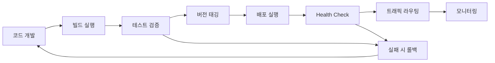

# 🚀 스킨 시스템 배포 가이드

이 섹션에서는 WithCookie WebBuilder 스킨 시스템의 배포와 관련된 모든 정보를 제공합니다.

## 📂 배포 가이드 구조

```
deployment/
├── README.md                    # 이 파일
├── cdn-hosting.md              # CDN 호스팅 가이드
├── static-hosting.md           # 정적 호스팅 옵션
├── version-management.md       # 버전 관리 전략
├── ci-cd-integration.md        # CI/CD 파이프라인 통합
└── monitoring-deployment.md    # 배포 모니터링
```

## 🎯 배포 전략 개요

### 배포 옵션 비교

| 옵션 | 복잡도 | 성능 | 비용 | 확장성 | 권장 용도 |
|------|--------|------|------|--------|-----------|
| **CDN 호스팅** | ⭐⭐⭐☆☆ | ⭐⭐⭐⭐⭐ | ⭐⭐⭐☆☆ | ⭐⭐⭐⭐⭐ | 프로덕션 환경 |
| **정적 호스팅** | ⭐⭐☆☆☆ | ⭐⭐⭐☆☆ | ⭐⭐⭐⭐☆ | ⭐⭐⭐☆☆ | 개발/테스트 |
| **자체 서버** | ⭐⭐⭐⭐☆ | ⭐⭐⭐⭐☆ | ⭐⭐☆☆☆ | ⭐⭐⭐⭐☆ | 기업 내부용 |
| **하이브리드** | ⭐⭐⭐⭐⭐ | ⭐⭐⭐⭐⭐ | ⭐⭐⭐☆☆ | ⭐⭐⭐⭐⭐ | 대규모 서비스 |

## 🔄 배포 프로세스

### 1. 기본 배포 워크플로우



### 2. 환경별 배포 전략

#### 개발 환경 (Development)
- **목적**: 개발자 테스트 및 실험
- **배포 방식**: 로컬 서버 또는 개발 CDN
- **업데이트 주기**: 즉시 배포
- **캐싱**: 최소화 (개발 편의성 우선)

```bash
# 개발 환경 배포 예시
npm run build:dev
npm run deploy:dev
```

#### 스테이징 환경 (Staging)
- **목적**: 프로덕션 환경 시뮬레이션
- **배포 방식**: 프로덕션과 동일한 구조
- **업데이트 주기**: 개발 완료 후
- **캐싱**: 프로덕션과 동일

```bash
# 스테이징 환경 배포 예시
npm run build:staging
npm run test:e2e
npm run deploy:staging
```

#### 프로덕션 환경 (Production)
- **목적**: 실제 사용자 서비스
- **배포 방식**: 다중 CDN + 로드밸런싱
- **업데이트 주기**: 신중한 릴리스 계획
- **캐싱**: 최대 성능 최적화

```bash
# 프로덕션 환경 배포 예시
npm run build:prod
npm run test:all
npm run deploy:prod
npm run health-check
```

## 📋 체크리스트

### 배포 전 확인사항

#### 코드 품질
- [ ] 모든 테스트 통과
- [ ] 코드 리뷰 완료
- [ ] 린트 에러 없음
- [ ] 타입 체크 통과
- [ ] 번들 크기 확인

#### 기능 검증
- [ ] 모든 지원 컴포넌트 타입 테스트
- [ ] 다양한 브라우저에서 동작 확인
- [ ] 모바일 환경 테스트
- [ ] 접근성 테스트 완료
- [ ] 성능 벤치마크 통과

#### 보안 검증
- [ ] 의존성 취약점 스캔
- [ ] CSP 헤더 설정 확인
- [ ] HTTPS 강제 적용
- [ ] 신뢰 도메인 검증

#### 인프라 준비
- [ ] CDN 설정 완료
- [ ] 모니터링 시스템 연동
- [ ] 백업 전략 수립
- [ ] 롤백 계획 준비

### 배포 후 확인사항

#### 즉시 확인 (5분 이내)
- [ ] Health Check 응답 정상
- [ ] 주요 스킨 로딩 확인
- [ ] 에러율 정상 범위
- [ ] 응답 시간 기준 충족

#### 단기 모니터링 (1시간 이내)
- [ ] 사용자 피드백 확인
- [ ] 에러 로그 모니터링
- [ ] 성능 지표 확인
- [ ] 캐시 히트율 확인

#### 장기 모니터링 (24시간 이내)
- [ ] 전체 시스템 안정성
- [ ] 사용자 행동 패턴 분석
- [ ] 성능 트렌드 분석
- [ ] 비용 최적화 검토

## 🛠️ 도구 및 서비스

### 권장 배포 도구

#### CDN 서비스
- **AWS CloudFront**: 글로벌 성능, Lambda@Edge 지원
- **Cloudflare**: 보안 기능, 무료 플랜 제공
- **Azure CDN**: Microsoft 생태계 통합
- **Google Cloud CDN**: GCP 인프라 활용

#### CI/CD 플랫폼
- **GitHub Actions**: Git 워크플로우 통합
- **GitLab CI/CD**: 완전한 DevOps 플랫폼
- **Jenkins**: 온프레미스 솔루션
- **CircleCI**: 클라우드 기반 CI/CD

#### 모니터링 도구
- **DataDog**: 종합 모니터링
- **New Relic**: APM 특화
- **Sentry**: 에러 추적
- **Google Analytics**: 사용자 행동 분석

## 🚀 빠른 시작

### 1. 간단한 정적 호스팅

가장 빠르게 시작할 수 있는 방법:

```bash
# 빌드 생성
npm run build

# GitHub Pages에 배포
npm install -g gh-pages
gh-pages -d dist

# 또는 Netlify에 배포
npx netlify deploy --prod --dir=dist
```

### 2. AWS S3 + CloudFront

본격적인 프로덕션 배포:

```bash
# AWS CLI 설정 후
aws s3 sync dist/ s3://my-skin-bucket --delete
aws cloudfront create-invalidation --distribution-id XXXXXX --paths "/*"
```

### 3. 자동화된 배포

CI/CD 파이프라인 설정:

```yaml
# .github/workflows/deploy.yml
name: Deploy Skin
on:
  push:
    tags: ['v*']
jobs:
  deploy:
    runs-on: ubuntu-latest
    steps:
      - uses: actions/checkout@v3
      - uses: actions/setup-node@v3
      - run: npm ci
      - run: npm run build
      - run: npm run deploy
```

## 📖 상세 가이드

각 배포 방식에 대한 상세한 가이드는 다음 문서들을 참조하세요:

1. **[CDN 호스팅](./cdn-hosting.md)** - 전문적인 CDN 배포
2. **[정적 호스팅](./static-hosting.md)** - 간단한 정적 호스팅
3. **[버전 관리](./version-management.md)** - 효과적인 버전 관리
4. **[CI/CD 통합](./ci-cd-integration.md)** - 자동화된 배포 파이프라인
5. **[배포 모니터링](./monitoring-deployment.md)** - 배포 상태 모니터링

---

> **💡 핵심 포인트**: 성공적인 스킨 배포는 **적절한 도구 선택, 체계적인 프로세스, 지속적인 모니터링**을 통해 달성됩니다. 환경에 맞는 배포 전략을 선택하고 점진적으로 개선해나가세요.