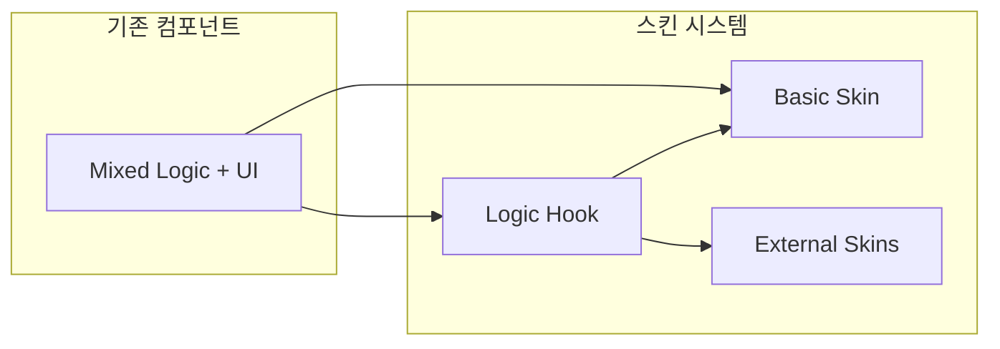

# 🔄 기존 컴포넌트 스킨 시스템 마이그레이션

## 📋 목차
1. [마이그레이션 개요](#마이그레이션-개요)
2. [준비 단계](#준비-단계)
3. [단계별 마이그레이션 가이드](#단계별-마이그레이션-가이드)
4. [검증 및 테스트](#검증-및-테스트)
5. [모범 사례](#모범-사례)

---

## 마이그레이션 개요

기존 컴포넌트를 스킨 시스템으로 마이그레이션하는 과정은 **로직과 UI의 분리**를 통해 더 유연하고 확장 가능한 구조로 전환하는 것입니다.

### 마이그레이션 이점

| 항목 | 기존 방식 | 스킨 시스템 |
|------|-----------|-------------|
| **UI 커스터마이징** | 컴포넌트 전체 수정 | 스킨만 교체 |
| **로직 재사용** | 중복 구현 | 완전 재사용 |
| **테스트** | UI + 로직 통합 테스트 | 로직 단위 테스트 가능 |
| **유지보수** | 복잡한 의존성 | 명확한 책임 분리 |
| **확장성** | 제한적 | 무제한 스킨 추가 |

### 마이그레이션 전략



---

## 준비 단계

### 1. 기존 컴포넌트 분석

먼저 기존 컴포넌트를 분석하여 로직과 UI를 식별합니다.

```typescript
// 기존 회원가입 컴포넌트 예시
const SignupComponent = () => {
  // 🔴 로직 부분 (분리 대상)
  const [formData, setFormData] = useState({
    username: '',
    email: '',
    password: '',
    confirmPassword: ''
  });
  const [errors, setErrors] = useState({});
  const [loading, setLoading] = useState(false);
  
  const validateForm = () => {
    const newErrors = {};
    if (!formData.username) newErrors.username = '사용자명을 입력하세요';
    if (!formData.email) newErrors.email = '이메일을 입력하세요';
    // ... 검증 로직
    setErrors(newErrors);
    return Object.keys(newErrors).length === 0;
  };
  
  const handleSubmit = async (e) => {
    e.preventDefault();
    if (!validateForm()) return;
    
    setLoading(true);
    try {
      await signupAPI(formData);
      // 성공 처리
    } catch (error) {
      setErrors({ submit: error.message });
    } finally {
      setLoading(false);
    }
  };
  
  // 🔵 UI 부분 (스킨으로 분리 대상)
  return (
    <div className="signup-container">
      <h2>회원가입</h2>
      <form onSubmit={handleSubmit}>
        <input
          type="text"
          value={formData.username}
          onChange={(e) => setFormData({...formData, username: e.target.value})}
          placeholder="사용자명"
        />
        {errors.username && <span className="error">{errors.username}</span>}
        
        {/* ... 기타 입력 필드들 */}
        
        <button type="submit" disabled={loading}>
          {loading ? '처리 중...' : '회원가입'}
        </button>
      </form>
    </div>
  );
};
```

### 2. 로직과 UI 식별표 작성

| 구분 | 항목 | 분류 |
|------|------|------|
| **상태 관리** | `formData`, `errors`, `loading` | 로직 |
| **유효성 검사** | `validateForm()` | 로직 |
| **API 호출** | `handleSubmit()`, `signupAPI()` | 로직 |
| **이벤트 핸들러** | `onChange`, `onSubmit` | 로직 |
| **JSX 구조** | `<form>`, `<input>`, `<button>` | UI |
| **스타일링** | CSS 클래스, 인라인 스타일 | UI |
| **레이아웃** | 컨테이너, 필드 배치 | UI |

### 3. Props 인터페이스 설계

```typescript
// 회원가입 컴포넌트 Props 인터페이스 설계
interface SignupSkinProps extends ComponentSkinProps {
  data: {
    formData: {
      username: string;
      email: string;
      password: string;
      confirmPassword: string;
    };
    validationErrors: Record<string, string>;
    loading: boolean;
    signupSuccess: boolean;
    signupError: string | null;
    theme: ThemeColors;
  };
  actions: {
    handleChange: (field: string, value: string) => void;
    handleSubmit: (e: React.FormEvent) => void;
    handleLoginClick: () => void;
  };
  options: {
    title: string;
    showTermsCheckbox: boolean;
    redirectPath: string;
    allowSocialSignup: boolean;
    requiredFields: string[];
    passwordMinLength: number;
    // 색상 커스터마이징
    primaryColor: string;
    backgroundColor: string;
    textColor: string;
  };
}
```

---

## 단계별 마이그레이션 가이드

### 1단계: 로직 훅 생성

```typescript
// useSignupLogic.ts - 로직만 분리
import { useState, useCallback } from 'react';
import { useDispatch } from 'react-redux';
import { signupUser } from '../../../redux/AuthSlice';

export function useSignupLogic(componentData: ComponentData, mode: ComponentRenderMode) {
  const dispatch = useDispatch();
  
  // 상태 관리
  const [formData, setFormData] = useState({
    username: '',
    email: '',
    password: '',
    confirmPassword: ''
  });
  
  const [validationErrors, setValidationErrors] = useState<Record<string, string>>({});
  const [loading, setLoading] = useState(false);
  const [signupSuccess, setSignupSuccess] = useState(false);
  const [signupError, setSignupError] = useState<string | null>(null);
  
  // 설정 옵션에서 필요한 값들 추출
  const options = componentData.props || {};
  const requiredFields = options.requiredFields || ['username', 'email', 'password'];
  const passwordMinLength = options.passwordMinLength || 8;
  
  // 유효성 검사 로직
  const validateForm = useCallback(() => {
    const errors: Record<string, string> = {};
    
    // 필수 필드 검사
    requiredFields.forEach(field => {
      if (!formData[field]?.trim()) {
        errors[field] = `${getFieldLabel(field)}을(를) 입력하세요`;
      }
    });
    
    // 이메일 형식 검사
    if (formData.email && !/^[^\s@]+@[^\s@]+\.[^\s@]+$/.test(formData.email)) {
      errors.email = '올바른 이메일 형식을 입력하세요';
    }
    
    // 비밀번호 길이 검사
    if (formData.password && formData.password.length < passwordMinLength) {
      errors.password = `비밀번호는 최소 ${passwordMinLength}자 이상이어야 합니다`;
    }
    
    // 비밀번호 확인
    if (formData.password !== formData.confirmPassword) {
      errors.confirmPassword = '비밀번호가 일치하지 않습니다';
    }
    
    setValidationErrors(errors);
    return Object.keys(errors).length === 0;
  }, [formData, requiredFields, passwordMinLength]);
  
  // 폼 필드 변경 핸들러
  const handleChange = useCallback((field: string, value: string) => {
    setFormData(prev => ({ ...prev, [field]: value }));
    
    // 실시간 유효성 검사
    if (validationErrors[field]) {
      setValidationErrors(prev => {
        const newErrors = { ...prev };
        delete newErrors[field];
        return newErrors;
      });
    }
  }, [validationErrors]);
  
  // 폼 제출 핸들러
  const handleSubmit = useCallback(async (e: React.FormEvent) => {
    e.preventDefault();
    
    // 에디터 모드에서는 실제 처리하지 않음
    if (mode === 'editor') {
      console.log('회원가입 폼 제출 (에디터 모드)');
      return;
    }
    
    if (!validateForm()) {
      return;
    }
    
    setLoading(true);
    setSignupError(null);
    
    try {
      await dispatch(signupUser({
        username: formData.username,
        email: formData.email,
        password: formData.password
      })).unwrap();
      
      setSignupSuccess(true);
      
      // 리다이렉트 처리
      const redirectPath = options.redirectPath || '/';
      setTimeout(() => {
        window.location.href = redirectPath;
      }, 2000);
      
    } catch (error: any) {
      setSignupError(error.message || '회원가입 중 오류가 발생했습니다');
    } finally {
      setLoading(false);
    }
  }, [formData, mode, validateForm, dispatch, options.redirectPath]);
  
  // 로그인 페이지로 이동
  const handleLoginClick = useCallback(() => {
    if (mode === 'editor') {
      console.log('로그인 페이지로 이동 (에디터 모드)');
      return;
    }
    window.location.href = '/login';
  }, [mode]);
  
  // 필드 라벨 매핑
  const getFieldLabel = (field: string) => {
    const labels = {
      username: '사용자명',
      email: '이메일',
      password: '비밀번호',
      confirmPassword: '비밀번호 확인'
    };
    return labels[field] || field;
  };
  
  // 로직 훅에서 반환할 데이터와 액션들
  return {
    // 데이터
    formData,
    validationErrors,
    loading,
    signupSuccess,
    signupError,
    theme: {}, // 테마 정보는 추후 Redux에서 가져올 예정
    
    // 액션들
    actions: {
      handleChange,
      handleSubmit,
      handleLoginClick
    }
  };
}

// 필드 라벨 헬퍼 함수
function getFieldLabel(field: string): string {
  const labels: Record<string, string> = {
    username: '사용자명',
    email: '이메일',
    password: '비밀번호',
    confirmPassword: '비밀번호 확인'
  };
  return labels[field] || field;
}
```

### 2단계: 기본 스킨 생성

```typescript
// BasicSignupSkin.tsx - 기존 UI를 스킨으로 변환
import React from 'react';
import { ComponentSkinProps } from '../../../types/component-skin';

const BasicSignupSkin: React.FC<ComponentSkinProps> = ({
  data,
  actions,
  options,
  mode,
  utils,
  app
}) => {
  const { t, cx } = utils;
  const {
    formData,
    validationErrors,
    loading,
    signupSuccess,
    signupError,
    theme
  } = data;
  
  const {
    handleChange,
    handleSubmit,
    handleLoginClick
  } = actions;
  
  // 옵션에서 설정값들 가져오기
  const {
    title = t('회원가입'),
    showTermsCheckbox = true,
    allowSocialSignup = false,
    primaryColor = theme?.primary || '#007bff',
    backgroundColor = '#ffffff',
    textColor = '#333333',
    requiredFields = ['username', 'email', 'password']
  } = options;
  
  // 스타일 정의
  const containerStyle = {
    maxWidth: '400px',
    margin: '50px auto',
    padding: '30px',
    backgroundColor,
    borderRadius: '8px',
    boxShadow: '0 2px 10px rgba(0, 0, 0, 0.1)',
    color: textColor
  };
  
  const titleStyle = {
    textAlign: 'center' as const,
    marginBottom: '30px',
    color: primaryColor,
    fontSize: '24px',
    fontWeight: 'bold'
  };
  
  const formGroupStyle = {
    marginBottom: '20px'
  };
  
  const labelStyle = {
    display: 'block',
    marginBottom: '5px',
    fontWeight: '500',
    color: textColor
  };
  
  const inputStyle = {
    width: '100%',
    padding: '12px',
    fontSize: '14px',
    border: '1px solid #ddd',
    borderRadius: '4px',
    boxSizing: 'border-box' as const,
    transition: 'border-color 0.2s'
  };
  
  const errorInputStyle = {
    ...inputStyle,
    borderColor: '#dc3545'
  };
  
  const errorStyle = {
    color: '#dc3545',
    fontSize: '12px',
    marginTop: '5px'
  };
  
  const buttonStyle = {
    width: '100%',
    padding: '12px',
    fontSize: '16px',
    fontWeight: 'bold',
    color: '#fff',
    backgroundColor: primaryColor,
    border: 'none',
    borderRadius: '4px',
    cursor: loading ? 'not-allowed' : 'pointer',
    opacity: loading ? 0.7 : 1,
    marginTop: '10px'
  };
  
  const linkButtonStyle = {
    background: 'none',
    border: 'none',
    color: primaryColor,
    textDecoration: 'underline',
    cursor: 'pointer',
    fontSize: '14px'
  };
  
  const successStyle = {
    backgroundColor: '#d4edda',
    color: '#155724',
    padding: '15px',
    borderRadius: '4px',
    textAlign: 'center' as const,
    marginBottom: '20px'
  };
  
  const errorMessageStyle = {
    backgroundColor: '#f8d7da',
    color: '#721c24',
    padding: '15px',
    borderRadius: '4px',
    marginBottom: '20px'
  };
  
  // 필드가 필수인지 확인
  const isRequired = (field: string) => requiredFields.includes(field);
  
  // 성공 상태일 때
  if (signupSuccess) {
    return (
      <div style={containerStyle}>
        <div style={successStyle}>
          <h3>{t('회원가입 완료!')}</h3>
          <p>{t('환영합니다! 잠시 후 페이지가 이동됩니다.')}</p>
        </div>
      </div>
    );
  }
  
  return (
    <div style={containerStyle}>
      <h2 style={titleStyle}>{title}</h2>
      
      {/* 전체 에러 메시지 */}
      {signupError && (
        <div style={errorMessageStyle}>
          {t(signupError)}
        </div>
      )}
      
      <form onSubmit={handleSubmit}>
        {/* 사용자명 */}
        <div style={formGroupStyle}>
          <label htmlFor="username" style={labelStyle}>
            {t('사용자명')} {isRequired('username') && '*'}
          </label>
          <input
            id="username"
            type="text"
            value={formData.username || ''}
            onChange={(e) => handleChange('username', e.target.value)}
            style={validationErrors.username ? errorInputStyle : inputStyle}
            placeholder={t('사용자명을 입력하세요')}
            required={isRequired('username')}
          />
          {validationErrors.username && (
            <div style={errorStyle}>{validationErrors.username}</div>
          )}
        </div>
        
        {/* 이메일 */}
        <div style={formGroupStyle}>
          <label htmlFor="email" style={labelStyle}>
            {t('이메일')} {isRequired('email') && '*'}
          </label>
          <input
            id="email"
            type="email"
            value={formData.email || ''}
            onChange={(e) => handleChange('email', e.target.value)}
            style={validationErrors.email ? errorInputStyle : inputStyle}
            placeholder={t('이메일을 입력하세요')}
            required={isRequired('email')}
          />
          {validationErrors.email && (
            <div style={errorStyle}>{validationErrors.email}</div>
          )}
        </div>
        
        {/* 비밀번호 */}
        <div style={formGroupStyle}>
          <label htmlFor="password" style={labelStyle}>
            {t('비밀번호')} {isRequired('password') && '*'}
          </label>
          <input
            id="password"
            type="password"
            value={formData.password || ''}
            onChange={(e) => handleChange('password', e.target.value)}
            style={validationErrors.password ? errorInputStyle : inputStyle}
            placeholder={t('비밀번호를 입력하세요')}
            required={isRequired('password')}
          />
          {validationErrors.password && (
            <div style={errorStyle}>{validationErrors.password}</div>
          )}
        </div>
        
        {/* 비밀번호 확인 */}
        <div style={formGroupStyle}>
          <label htmlFor="confirmPassword" style={labelStyle}>
            {t('비밀번호 확인')} {isRequired('confirmPassword') && '*'}
          </label>
          <input
            id="confirmPassword"
            type="password"
            value={formData.confirmPassword || ''}
            onChange={(e) => handleChange('confirmPassword', e.target.value)}
            style={validationErrors.confirmPassword ? errorInputStyle : inputStyle}
            placeholder={t('비밀번호를 다시 입력하세요')}
            required={isRequired('confirmPassword')}
          />
          {validationErrors.confirmPassword && (
            <div style={errorStyle}>{validationErrors.confirmPassword}</div>
          )}
        </div>
        
        {/* 이용약관 동의 (옵션) */}
        {showTermsCheckbox && (
          <div style={formGroupStyle}>
            <label style={{ display: 'flex', alignItems: 'center', gap: '8px' }}>
              <input type="checkbox" required />
              <span style={{ fontSize: '14px' }}>
                {t('이용약관 및 개인정보처리방침에 동의합니다')} *
              </span>
            </label>
          </div>
        )}
        
        {/* 회원가입 버튼 */}
        <button
          type="submit"
          disabled={loading}
          style={buttonStyle}
          onMouseOver={(e) => {
            if (!loading) {
              e.currentTarget.style.opacity = '0.9';
            }
          }}
          onMouseOut={(e) => {
            if (!loading) {
              e.currentTarget.style.opacity = '1';
            }
          }}
        >
          {loading ? t('처리 중...') : t('회원가입')}
        </button>
        
        {/* 소셜 회원가입 (옵션) */}
        {allowSocialSignup && (
          <div style={{ marginTop: '20px', textAlign: 'center' }}>
            <div style={{ margin: '20px 0', fontSize: '14px', color: '#666' }}>
              {t('또는')}
            </div>
            <button
              type="button"
              style={{
                ...buttonStyle,
                backgroundColor: '#4267B2',
                marginBottom: '10px'
              }}
            >
              {t('Facebook으로 가입')}
            </button>
            <button
              type="button"
              style={{
                ...buttonStyle,
                backgroundColor: '#db4437'
              }}
            >
              {t('Google로 가입')}
            </button>
          </div>
        )}
        
        {/* 로그인 링크 */}
        <div style={{ textAlign: 'center', marginTop: '20px' }}>
          <span style={{ fontSize: '14px' }}>
            {t('이미 계정이 있으신가요?')} {' '}
            <button
              type="button"
              onClick={handleLoginClick}
              style={linkButtonStyle}
            >
              {t('로그인')}
            </button>
          </span>
        </div>
      </form>
    </div>
  );
};

export default BasicSignupSkin;
```

### 3단계: 스킨 가능한 컴포넌트 정의

```typescript
// SignupSkinnable.tsx - 스킨 시스템 통합
import React from 'react';
import { SkinnableComponent } from '../../../types/component-skin';
import { useSignupLogic } from './SignupLogic';
import BasicSignupSkin from './skins/BasicSignupSkin';
import { COMPONENT_TYPES } from '../../../constants';

export const SignupSkinnable: SkinnableComponent = {
  type: COMPONENT_TYPES.SIGNUP,
  name: '회원가입',
  category: 'form',
  icon: '📝',
  
  // 기본 스킨
  defaultSkin: 'basic',
  
  // 내장 스킨들
  internalSkins: {
    'basic': BasicSignupSkin,
    // 추후 다른 내장 스킨들 추가 가능
    // 'modern': ModernSignupSkin,
    // 'minimal': MinimalSignupSkin
  },
  
  // 컴포넌트 로직
  useLogic: useSignupLogic,
  
  // 설정 옵션들
  options: [
    {
      name: 'title',
      label: '제목',
      type: 'text',
      default: '회원가입'
    },
    {
      name: 'redirectPath',
      label: '가입 후 이동 경로',
      type: 'text',
      default: '/'
    },
    {
      name: 'showTermsCheckbox',
      label: '이용약관 동의 표시',
      type: 'checkbox',
      default: true
    },
    {
      name: 'allowSocialSignup',
      label: '소셜 회원가입 허용',
      type: 'checkbox',
      default: false
    },
    {
      name: 'requiredFields',
      label: '필수 입력 필드',
      type: 'select',
      options: [
        { value: ['username', 'email', 'password'], label: '기본 (사용자명, 이메일, 비밀번호)' },
        { value: ['email', 'password'], label: '간단 (이메일, 비밀번호만)' },
        { value: ['username', 'email', 'password', 'confirmPassword'], label: '전체' }
      ],
      default: ['username', 'email', 'password']
    },
    {
      name: 'passwordMinLength',
      label: '최소 비밀번호 길이',
      type: 'number',
      min: 4,
      max: 20,
      default: 8
    },
    // 색상 커스터마이징 옵션
    {
      name: 'primaryColor',
      label: '주요 색상',
      type: 'color',
      default: '#007bff'
    },
    {
      name: 'backgroundColor',
      label: '배경 색상',
      type: 'color',
      default: '#ffffff'
    },
    {
      name: 'textColor',
      label: '텍스트 색상',
      type: 'color',
      default: '#333333'
    }
  ],
  
  // 기본 Props
  defaultProps: {
    redirectPath: '/',
    showTermsCheckbox: true,
    allowSocialSignup: false,
    requiredFields: ['username', 'email', 'password'],
    passwordMinLength: 8,
    style: {
      padding: '20px',
      margin: '0 auto',
      maxWidth: '500px'
    }
  },
  
  // 외부 스킨 지원
  supportsExternalSkins: true
};
```

### 4단계: 컴포넌트 등록

```typescript
// signup/index.tsx - 컴포넌트 등록
import { COMPONENT_TYPES } from '../../../constants';
import { registerSkinnableComponent } from '../registry';
import { SignupSkinnable } from './SignupSkinnable';

// 기존 컴포넌트 임포트
import SignupComponent from './Signup.component';
import SignupEditor from './Signup.editor';
import SignupProperties from './Signup.properties';

// 스킨 시스템 사용 여부 플래그
const USE_SKIN_SYSTEM = true;

if (USE_SKIN_SYSTEM) {
  // 새로운 스킨 시스템 사용
  registerSkinnableComponent(SignupSkinnable);
  console.log('✅ 회원가입 컴포넌트 스킨 시스템 적용 완료');
} else {
  // 기존 방식 유지 (호환성)
  registerComponent({
    type: COMPONENT_TYPES.SIGNUP,
    component: SignupComponent,
    editorComponent: SignupEditor,
    properties: SignupProperties,
    category: 'form',
    icon: '📝',
    name: '회원가입'
  });
}

// 타입 정의 및 기존 컴포넌트 내보내기
export { SignupSkinnable } from './SignupSkinnable';
export { default as SignupComponent } from './Signup.component';
export { default as SignupEditor } from './Signup.editor';
export { default as SignupProperties } from './Signup.properties';
export * from './Signup.types';
```

---

## 검증 및 테스트

### 1. 기능 검증 체크리스트

```typescript
// 마이그레이션 검증 체크리스트
export const MigrationChecklist = {
  // 로직 검증
  logic: [
    '✅ 모든 상태가 올바르게 관리되는가?',
    '✅ 이벤트 핸들러가 정상 동작하는가?',
    '✅ API 호출이 올바르게 이루어지는가?',
    '✅ 유효성 검사가 제대로 작동하는가?',
    '✅ 에러 처리가 적절한가?'
  ],
  
  // UI 검증
  ui: [
    '✅ 기존 UI와 동일하게 렌더링되는가?',
    '✅ 스타일이 올바르게 적용되는가?',
    '✅ 반응형 디자인이 동작하는가?',
    '✅ 접근성 요구사항을 만족하는가?',
    '✅ 다국어 지원이 정상 동작하는가?'
  ],
  
  // Props 검증
  props: [
    '✅ 모든 필요한 데이터가 전달되는가?',
    '✅ 액션 함수들이 올바르게 연결되는가?',
    '✅ 옵션 설정이 정상 반영되는가?',
    '✅ 타입 안전성이 보장되는가?',
    '✅ 기본값 처리가 올바른가?'
  ],
  
  // 호환성 검증
  compatibility: [
    '✅ 기존 코드와 호환되는가?',
    '✅ 기존 설정이 그대로 작동하는가?',
    '✅ 에디터 모드가 정상 동작하는가?',
    '✅ 프리뷰 모드가 정상 동작하는가?',
    '✅ 외부 스킨 로딩이 가능한가?'
  ]
};
```

### 2. 자동화 테스트 작성

```typescript
// SignupLogic.test.ts - 로직 단위 테스트
import { renderHook, act } from '@testing-library/react';
import { useSignupLogic } from './SignupLogic';

describe('useSignupLogic', () => {
  const mockComponentData = {
    id: 'test-signup',
    type: 'signup',
    props: {
      requiredFields: ['username', 'email', 'password'],
      passwordMinLength: 8
    }
  };
  
  it('초기 상태가 올바르게 설정되어야 한다', () => {
    const { result } = renderHook(() => 
      useSignupLogic(mockComponentData, 'preview')
    );
    
    expect(result.current.formData).toEqual({
      username: '',
      email: '',
      password: '',
      confirmPassword: ''
    });
    expect(result.current.loading).toBe(false);
    expect(result.current.signupSuccess).toBe(false);
  });
  
  it('필드 변경이 올바르게 처리되어야 한다', () => {
    const { result } = renderHook(() => 
      useSignupLogic(mockComponentData, 'preview')
    );
    
    act(() => {
      result.current.actions.handleChange('username', 'testuser');
    });
    
    expect(result.current.formData.username).toBe('testuser');
  });
  
  it('유효성 검사가 올바르게 동작해야 한다', () => {
    const { result } = renderHook(() => 
      useSignupLogic(mockComponentData, 'preview')
    );
    
    // 빈 폼으로 제출 시도
    act(() => {
      const event = { preventDefault: jest.fn() } as any;
      result.current.actions.handleSubmit(event);
    });
    
    expect(Object.keys(result.current.validationErrors)).toHaveLength(3);
    expect(result.current.validationErrors.username).toBeDefined();
    expect(result.current.validationErrors.email).toBeDefined();
    expect(result.current.validationErrors.password).toBeDefined();
  });
});
```

```typescript
// BasicSignupSkin.test.tsx - 스킨 렌더링 테스트
import React from 'react';
import { render, screen, fireEvent } from '@testing-library/react';
import BasicSignupSkin from './BasicSignupSkin';

const mockProps = {
  data: {
    formData: { username: '', email: '', password: '', confirmPassword: '' },
    validationErrors: {},
    loading: false,
    signupSuccess: false,
    signupError: null,
    theme: { primary: '#007bff' }
  },
  actions: {
    handleChange: jest.fn(),
    handleSubmit: jest.fn(),
    handleLoginClick: jest.fn()
  },
  options: {
    title: '회원가입',
    showTermsCheckbox: true,
    allowSocialSignup: false,
    requiredFields: ['username', 'email', 'password']
  },
  mode: 'preview' as const,
  utils: {
    t: (key: string) => key,
    cx: (...classes: any[]) => classes.join(' '),
    navigate: jest.fn(),
    formatCurrency: jest.fn(),
    formatDate: jest.fn(),
    getAssetUrl: jest.fn()
  },
  app: {}
};

describe('BasicSignupSkin', () => {
  it('기본 폼 요소들이 렌더링되어야 한다', () => {
    render(<BasicSignupSkin {...mockProps} />);
    
    expect(screen.getByLabelText(/사용자명/)).toBeInTheDocument();
    expect(screen.getByLabelText(/이메일/)).toBeInTheDocument();
    expect(screen.getByLabelText(/비밀번호/)).toBeInTheDocument();
    expect(screen.getByRole('button', { name: /회원가입/ })).toBeInTheDocument();
  });
  
  it('입력 변경이 올바르게 처리되어야 한다', () => {
    render(<BasicSignupSkin {...mockProps} />);
    
    const usernameInput = screen.getByLabelText(/사용자명/);
    fireEvent.change(usernameInput, { target: { value: 'testuser' } });
    
    expect(mockProps.actions.handleChange).toHaveBeenCalledWith('username', 'testuser');
  });
  
  it('유효성 오류가 표시되어야 한다', () => {
    const propsWithErrors = {
      ...mockProps,
      data: {
        ...mockProps.data,
        validationErrors: {
          username: '사용자명을 입력하세요'
        }
      }
    };
    
    render(<BasicSignupSkin {...propsWithErrors} />);
    expect(screen.getByText('사용자명을 입력하세요')).toBeInTheDocument();
  });
  
  it('성공 상태가 올바르게 표시되어야 한다', () => {
    const successProps = {
      ...mockProps,
      data: {
        ...mockProps.data,
        signupSuccess: true
      }
    };
    
    render(<BasicSignupSkin {...successProps} />);
    expect(screen.getByText(/회원가입 완료/)).toBeInTheDocument();
  });
});
```

### 3. 통합 테스트

```typescript
// SignupIntegration.test.tsx - 통합 테스트
import React from 'react';
import { render, screen, fireEvent, waitFor } from '@testing-library/react';
import { Provider } from 'react-redux';
import { configureStore } from '@reduxjs/toolkit';
import ComponentSkinWrapper from '../../../skins/ComponentSkinWrapper';
import { SignupSkinnable } from './SignupSkinnable';

// 테스트용 스토어 설정
const createTestStore = () => configureStore({
  reducer: {
    auth: (state = { loading: false }, action) => state
  }
});

describe('Signup Component Integration', () => {
  const mockComponentData = {
    id: 'test-signup',
    type: 'signup',
    props: {
      title: '테스트 회원가입',
      requiredFields: ['username', 'email', 'password']
    }
  };
  
  it('전체 회원가입 플로우가 정상 동작해야 한다', async () => {
    const store = createTestStore();
    
    render(
      <Provider store={store}>
        <ComponentSkinWrapper
          component={SignupSkinnable}
          componentData={mockComponentData}
          mode="preview"
        />
      </Provider>
    );
    
    // 제목 확인
    expect(screen.getByText('테스트 회원가입')).toBeInTheDocument();
    
    // 폼 입력
    fireEvent.change(screen.getByLabelText(/사용자명/), {
      target: { value: 'testuser' }
    });
    fireEvent.change(screen.getByLabelText(/이메일/), {
      target: { value: 'test@example.com' }
    });
    fireEvent.change(screen.getByLabelText(/비밀번호/), {
      target: { value: 'password123' }
    });
    fireEvent.change(screen.getByLabelText(/비밀번호 확인/), {
      target: { value: 'password123' }
    });
    
    // 폼 제출
    fireEvent.click(screen.getByRole('button', { name: /회원가입/ }));
    
    // 로딩 상태 확인
    await waitFor(() => {
      expect(screen.getByText(/처리 중/)).toBeInTheDocument();
    });
  });
});
```

---

## 모범 사례

### 1. 점진적 마이그레이션

```typescript
// 점진적 마이그레이션을 위한 플래그 시스템
export class MigrationManager {
  private static migrationFlags = new Map<string, boolean>();
  
  // 컴포넌트별 마이그레이션 상태 관리
  public static setMigrationFlag(componentType: string, enabled: boolean): void {
    this.migrationFlags.set(componentType, enabled);
    localStorage.setItem(`migration_${componentType}`, enabled.toString());
  }
  
  public static isMigrationEnabled(componentType: string): boolean {
    // 로컬 스토리지에서 설정 확인
    const stored = localStorage.getItem(`migration_${componentType}`);
    if (stored !== null) {
      return stored === 'true';
    }
    
    // 메모리 설정 확인
    return this.migrationFlags.get(componentType) || false;
  }
  
  // 안전한 마이그레이션을 위한 래퍼
  public static createMigrationWrapper(
    componentType: string,
    legacyComponent: React.ComponentType,
    skinnableComponent: SkinnableComponent
  ): React.ComponentType {
    return (props: any) => {
      const useSkinSystem = this.isMigrationEnabled(componentType);
      
      if (useSkinSystem) {
        return (
          <ComponentSkinWrapper
            component={skinnableComponent}
            componentData={props}
            mode="preview"
          />
        );
      } else {
        return React.createElement(legacyComponent, props);
      }
    };
  }
}

// 사용 예시
const SignupComponentWrapper = MigrationManager.createMigrationWrapper(
  'signup',
  LegacySignupComponent,
  SignupSkinnable
);

// A/B 테스트나 단계적 출시
MigrationManager.setMigrationFlag('signup', true); // 스킨 시스템 활성화
```

### 2. 호환성 유지

```typescript
// 기존 Props와 새 Props 간 변환
export class PropsAdapter {
  // 기존 컴포넌트 Props를 스킨 시스템 Props로 변환
  public static adaptLegacyProps(legacyProps: any, componentType: string): ComponentData {
    switch (componentType) {
      case 'signup':
        return this.adaptSignupProps(legacyProps);
      case 'login':
        return this.adaptLoginProps(legacyProps);
      default:
        return {
          id: legacyProps.id || 'legacy-component',
          type: componentType,
          props: legacyProps
        };
    }
  }
  
  private static adaptSignupProps(legacyProps: any): ComponentData {
    return {
      id: legacyProps.id || 'signup-component',
      type: 'signup',
      props: {
        // 기존 설정 매핑
        title: legacyProps.title || legacyProps.heading,
        redirectPath: legacyProps.redirectUrl || legacyProps.successUrl,
        showTermsCheckbox: legacyProps.requireTerms,
        allowSocialSignup: legacyProps.enableSocial,
        
        // 색상 설정 매핑
        primaryColor: legacyProps.buttonColor || legacyProps.themeColor,
        backgroundColor: legacyProps.bgColor,
        textColor: legacyProps.textColor,
        
        // 기타 설정
        ...legacyProps
      },
      componentProps: legacyProps.componentProps || {}
    };
  }
}
```

### 3. 성능 최적화

```typescript
// 마이그레이션된 컴포넌트 성능 모니터링
export class MigrationPerformanceMonitor {
  private static performanceData = new Map<string, any>();
  
  public static measureMigrationPerformance(
    componentType: string,
    renderFn: () => React.ReactElement
  ): React.ReactElement {
    const startTime = performance.now();
    
    const result = renderFn();
    
    const endTime = performance.now();
    const renderTime = endTime - startTime;
    
    this.recordPerformance(componentType, renderTime);
    
    return result;
  }
  
  private static recordPerformance(componentType: string, renderTime: number): void {
    const existing = this.performanceData.get(componentType) || {
      count: 0,
      totalTime: 0,
      avgTime: 0,
      maxTime: 0,
      minTime: Infinity
    };
    
    existing.count++;
    existing.totalTime += renderTime;
    existing.avgTime = existing.totalTime / existing.count;
    existing.maxTime = Math.max(existing.maxTime, renderTime);
    existing.minTime = Math.min(existing.minTime, renderTime);
    
    this.performanceData.set(componentType, existing);
    
    // 성능 이슈 감지
    if (renderTime > 100) { // 100ms 이상
      console.warn(`⚠️ 느린 렌더링 감지: ${componentType} (${renderTime.toFixed(2)}ms)`);
    }
  }
  
  public static getPerformanceReport(): any {
    return Object.fromEntries(this.performanceData);
  }
}
```

### 4. 에러 처리 및 폴백

```typescript
// 마이그레이션 중 에러 처리
export class MigrationErrorBoundary extends React.Component<
  { children: React.ReactNode; fallback: React.ComponentType; componentType: string },
  { hasError: boolean; error?: Error }
> {
  constructor(props: any) {
    super(props);
    this.state = { hasError: false };
  }
  
  static getDerivedStateFromError(error: Error): any {
    return { hasError: true, error };
  }
  
  componentDidCatch(error: Error, errorInfo: React.ErrorInfo): void {
    console.error(`❌ 마이그레이션 에러 [${this.props.componentType}]:`, error);
    
    // 에러 리포팅
    this.reportMigrationError(error, errorInfo);
    
    // 자동으로 레거시 모드로 복원
    MigrationManager.setMigrationFlag(this.props.componentType, false);
  }
  
  private reportMigrationError(error: Error, errorInfo: React.ErrorInfo): void {
    const report = {
      componentType: this.props.componentType,
      error: {
        message: error.message,
        stack: error.stack
      },
      errorInfo,
      timestamp: Date.now(),
      userAgent: navigator.userAgent
    };
    
    fetch('/api/migration/errors', {
      method: 'POST',
      headers: { 'Content-Type': 'application/json' },
      body: JSON.stringify(report)
    }).catch(err => console.error('에러 리포팅 실패:', err));
  }
  
  render(): React.ReactNode {
    if (this.state.hasError) {
      const FallbackComponent = this.props.fallback;
      return <FallbackComponent />;
    }
    
    return this.props.children;
  }
}

// 사용 예시
const SafeMigratedComponent = ({ ...props }) => (
  <MigrationErrorBoundary
    componentType="signup"
    fallback={LegacySignupComponent}
  >
    <ComponentSkinWrapper
      component={SignupSkinnable}
      componentData={props}
      mode="preview"
    />
  </MigrationErrorBoundary>
);
```

---

## 다음 단계

1. 📖 **[외부 스킨 개발](./external-skin-development.md)** - 외부 개발자를 위한 스킨 제작 가이드
2. 🧪 **[테스트 및 디버깅](./testing-debugging.md)** - 품질 보증 방법
3. 🎯 **[고급 패턴](./advanced-patterns.md)** - 전문가 수준 개발 기법

---

> **💡 핵심 포인트**: 마이그레이션은 점진적이고 안전하게 진행해야 합니다. 기존 기능을 보존하면서 새로운 확장성을 얻는 것이 목표입니다. 철저한 테스트와 성능 모니터링을 통해 안정적인 전환을 보장하세요.