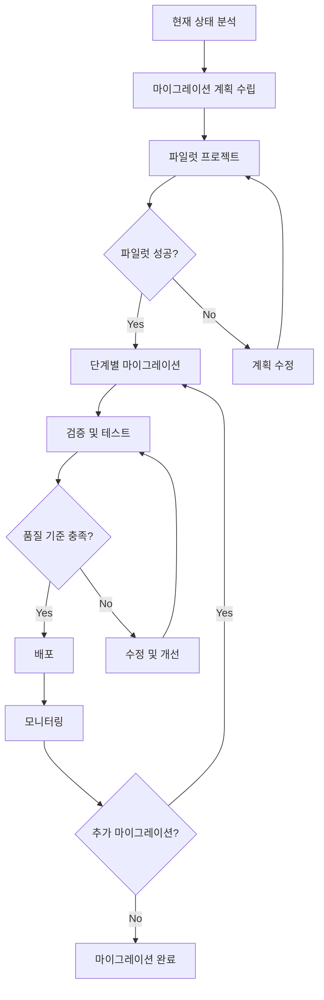

# 🔄 스킨 시스템 마이그레이션 가이드

이 섹션에서는 기존 시스템에서 WithCookie WebBuilder 스킨 시스템으로의 마이그레이션과 관련된 모든 정보를 제공합니다.

## 📂 마이그레이션 가이드 구조

```
migration/
├── README.md                    # 이 파일
├── planning-assessment.md       # 마이그레이션 계획 및 평가
├── legacy-system-analysis.md    # 기존 시스템 분석
├── migration-strategies.md      # 마이그레이션 전략
├── step-by-step-guide.md       # 단계별 마이그레이션 가이드
└── rollback-procedures.md      # 롤백 절차
```

## 🎯 마이그레이션 개요

### 마이그레이션 목표

| 목표 | 설명 | 성공 지표 |
|------|------|----------|
| **무중단 전환** | 서비스 중단 없이 점진적 마이그레이션 | 99.9% 업타임 유지 |
| **성능 개선** | 로딩 속도 및 사용자 경험 향상 | 30% 이상 성능 개선 |
| **확장성 확보** | 새로운 스킨 개발 및 배포 용이성 | 스킨 개발 시간 50% 단축 |
| **유지보수성** | 코드 품질 및 관리 용이성 향상 | 버그 수정 시간 40% 단축 |

### 마이그레이션 유형

#### 1. 전면 마이그레이션 (Big Bang)
- **적용 대상**: 소규모 시스템 (< 10개 컴포넌트)
- **기간**: 1-2주
- **위험도**: 높음
- **장점**: 빠른 완료, 일관성 확보
- **단점**: 높은 위험도, 롤백 어려움

#### 2. 점진적 마이그레이션 (Incremental)
- **적용 대상**: 중대규모 시스템 (10-50개 컴포넌트)
- **기간**: 1-3개월
- **위험도**: 중간
- **장점**: 위험 분산, 학습 기회
- **단점**: 복잡한 관리, 혼재 기간

#### 3. 병렬 마이그레이션 (Parallel)
- **적용 대상**: 대규모 시스템 (50+ 컴포넌트)
- **기간**: 3-6개월
- **위험도**: 낮음
- **장점**: 안전성, 충분한 테스트
- **단점**: 긴 기간, 높은 비용

## 📋 마이그레이션 프로세스

### 전체 워크플로우



### 단계별 개요

#### Phase 1: 준비 및 계획 (1-2주)
- 현재 시스템 분석
- 마이그레이션 전략 수립
- 팀 교육 및 환경 구성
- 파일럿 컴포넌트 선정

#### Phase 2: 파일럿 마이그레이션 (1-2주)
- 가장 간단한 컴포넌트 마이그레이션
- 프로세스 검증 및 개선
- 도구 및 자동화 구축
- 초기 성능 측정

#### Phase 3: 본격 마이그레이션 (4-12주)
- 우선순위에 따른 단계별 마이그레이션
- 지속적인 테스트 및 검증
- 성능 모니터링
- 사용자 피드백 수집

#### Phase 4: 마무리 및 최적화 (1-2주)
- 남은 컴포넌트 마이그레이션 완료
- 전체 시스템 최적화
- 문서화 및 지식 전수
- 레거시 시스템 정리

## 🔍 현재 상태 평가

### 시스템 분석 체크리스트

#### 기술적 분석
- [ ] 현재 사용 중인 프레임워크 및 라이브러리 목록
- [ ] 컴포넌트 개수 및 복잡도 분석
- [ ] 의존성 관계 매핑
- [ ] 성능 지표 수집 (로딩 시간, 번들 크기 등)
- [ ] 현재 빌드 및 배포 프로세스 분석
- [ ] 테스트 커버리지 확인

#### 비즈니스 분석
- [ ] 사용자 트래픽 패턴 분석
- [ ] 중요도별 컴포넌트 분류
- [ ] 변경 빈도 분석
- [ ] 개발팀 리소스 평가
- [ ] 예산 및 일정 제약 사항
- [ ] 비즈니스 연속성 요구사항

### 분석 도구 및 스크립트

```javascript
// 현재 시스템 분석 도구
class SystemAnalyzer {
  constructor() {
    this.components = new Map()
    this.dependencies = new Map()
    this.metrics = new Map()
  }
  
  // 컴포넌트 복잡도 분석
  analyzeComplexity() {
    const analysis = {
      totalComponents: 0,
      complexity: {
        simple: [],    // < 100 LOC, 단순 UI
        medium: [],    // 100-500 LOC, 중간 로직
        complex: [],   // > 500 LOC, 복잡한 상태 관리
        critical: []   // 비즈니스 크리티컬
      },
      dependencies: this.analyzeDependencies(),
      recommendations: []
    }
    
    // 각 컴포넌트 분석
    this.components.forEach((component, name) => {
      const complexity = this.calculateComplexity(component)
      const category = this.categorizeComplexity(complexity)
      
      analysis.complexity[category].push({
        name,
        complexity,
        linesOfCode: component.linesOfCode,
        dependencies: component.dependencies.length,
        lastModified: component.lastModified
      })
      
      analysis.totalComponents++
    })
    
    // 마이그레이션 권장사항 생성
    analysis.recommendations = this.generateMigrationRecommendations(analysis)
    
    return analysis
  }
  
  calculateComplexity(component) {
    let score = 0
    
    // 코드 라인 수
    score += component.linesOfCode * 0.1
    
    // 상태 관리 복잡도
    score += component.stateVariables * 2
    
    // 의존성 수
    score += component.dependencies.length * 3
    
    // API 호출 수
    score += component.apiCalls * 5
    
    // 이벤트 핸들러 수
    score += component.eventHandlers * 1
    
    return Math.min(score, 100) // 0-100 스케일
  }
  
  generateMigrationRecommendations(analysis) {
    const recommendations = []
    
    // 마이그레이션 순서 추천
    const migrationOrder = [
      ...analysis.complexity.simple,
      ...analysis.complexity.medium,
      ...analysis.complexity.complex,
      ...analysis.complexity.critical
    ]
    
    recommendations.push({
      type: 'migration-order',
      title: '권장 마이그레이션 순서',
      order: migrationOrder.slice(0, 10), // 상위 10개
      reasoning: '복잡도가 낮고 의존성이 적은 컴포넌트부터 시작'
    })
    
    // 위험 요소 식별
    const highRiskComponents = analysis.complexity.critical.filter(
      c => c.complexity > 80 || c.dependencies > 10
    )
    
    if (highRiskComponents.length > 0) {
      recommendations.push({
        type: 'risk-mitigation',
        title: '고위험 컴포넌트 대응 방안',
        components: highRiskComponents,
        actions: [
          '추가 테스트 커버리지 확보',
          '전문가 리뷰 필수',
          '단계별 마이그레이션 적용',
          '롤백 계획 수립'
        ]
      })
    }
    
    return recommendations
  }
}

// 사용 예시
const analyzer = new SystemAnalyzer()
analyzer.scanProject('./src/components')
const analysis = analyzer.analyzeComplexity()
console.log('마이그레이션 분석 결과:', analysis)
```

## 🚀 마이그레이션 전략

### 전략별 상세 가이드

#### 1. 컴포넌트별 점진적 마이그레이션

```javascript
// 마이그레이션 계획 수립
class MigrationPlanner {
  constructor() {
    this.migrationPhases = []
    this.dependencies = new Map()
    this.priorities = new Map()
  }
  
  createMigrationPlan(components) {
    // 1. 의존성 그래프 생성
    const dependencyGraph = this.buildDependencyGraph(components)
    
    // 2. 우선순위 계산
    const prioritizedComponents = this.calculatePriorities(components)
    
    // 3. 마이그레이션 단계 구성
    const phases = this.groupIntoPhases(prioritizedComponents, dependencyGraph)
    
    return {
      totalComponents: components.length,
      estimatedDuration: this.estimateDuration(phases),
      phases,
      risks: this.identifyRisks(phases),
      resources: this.estimateResources(phases)
    }
  }
  
  calculatePriorities(components) {
    return components.map(component => {
      let score = 0
      
      // 비즈니스 중요도
      score += component.businessCritical ? 100 : 0
      
      // 사용 빈도
      score += component.usageFrequency * 10
      
      // 마이그레이션 난이도 (낮을수록 높은 점수)
      score += (100 - component.complexity) * 0.5
      
      // 의존성 (적을수록 높은 점수)
      score += Math.max(0, 20 - component.dependencies.length) * 2
      
      return {
        ...component,
        migrationPriority: score
      }
    }).sort((a, b) => b.migrationPriority - a.migrationPriority)
  }
  
  groupIntoPhases(components, dependencyGraph) {
    const phases = []
    const migrated = new Set()
    const maxPhases = 10
    
    for (let phaseNum = 1; phaseNum <= maxPhases; phaseNum++) {
      const phase = {
        number: phaseNum,
        components: [],
        estimatedDuration: 0,
        risks: []
      }
      
      // 의존성이 해결된 컴포넌트들 중에서 선택
      const available = components.filter(comp => 
        !migrated.has(comp.name) &&
        this.areDependenciesMigrated(comp, migrated, dependencyGraph)
      )
      
      if (available.length === 0) break
      
      // 단계별 적정 개수 (3-5개)
      const phaseComponents = available.slice(0, 5)
      phase.components = phaseComponents
      
      phaseComponents.forEach(comp => migrated.add(comp.name))
      
      phase.estimatedDuration = this.estimatePhaseDuration(phaseComponents)
      phase.risks = this.identifyPhaseRisks(phaseComponents)
      
      phases.push(phase)
    }
    
    return phases
  }
}
```

#### 2. 기능별 병렬 마이그레이션

```javascript
// 기능 도메인별 마이그레이션 전략
class DomainBasedMigration {
  constructor() {
    this.domains = new Map([
      ['authentication', { priority: 1, risk: 'high' }],
      ['user-profile', { priority: 2, risk: 'medium' }],
      ['dashboard', { priority: 3, risk: 'medium' }],
      ['admin', { priority: 4, risk: 'low' }],
      ['reports', { priority: 5, risk: 'low' }]
    ])
  }
  
  organizeMigrationByDomain(components) {
    const domainGroups = new Map()
    
    // 컴포넌트를 도메인별로 그룹화
    components.forEach(component => {
      const domain = this.identifyDomain(component)
      
      if (!domainGroups.has(domain)) {
        domainGroups.set(domain, {
          domain,
          components: [],
          ...this.domains.get(domain)
        })
      }
      
      domainGroups.get(domain).components.push(component)
    })
    
    // 우선순위순으로 정렬
    return Array.from(domainGroups.values())
      .sort((a, b) => a.priority - b.priority)
  }
  
  createParallelMigrationPlan(domainGroups) {
    const plan = {
      timeline: [],
      resourceAllocation: new Map(),
      dependencies: this.analyzeDomainDependencies(domainGroups)
    }
    
    // 병렬 실행 가능한 도메인 그룹 식별
    const parallelGroups = this.identifyParallelGroups(domainGroups)
    
    parallelGroups.forEach((group, index) => {
      plan.timeline.push({
        week: index + 1,
        domains: group,
        estimatedEffort: this.calculateGroupEffort(group),
        requiredTeams: this.calculateRequiredTeams(group)
      })
    })
    
    return plan
  }
}
```

## 🛠️ 마이그레이션 도구

### 자동화 도구 개발

```javascript
// 마이그레이션 자동화 도구
class MigrationAutomator {
  constructor() {
    this.templates = new Map()
    this.transformers = new Map()
    this.validators = new Map()
  }
  
  // 기존 컴포넌트 자동 분석
  async analyzeComponent(componentPath) {
    const source = await fs.readFile(componentPath, 'utf8')
    const ast = this.parseToAST(source)
    
    return {
      type: this.detectComponentType(ast),
      props: this.extractProps(ast),
      state: this.extractState(ast),
      methods: this.extractMethods(ast),
      dependencies: this.extractDependencies(ast),
      hooks: this.extractHooks(ast),
      complexity: this.calculateComplexity(ast)
    }
  }
  
  // 스킨 컴포넌트 템플릿 생성
  async generateSkinTemplate(analysis) {
    const template = this.templates.get(analysis.type) || this.templates.get('default')
    
    const skinComponent = template
      .replace(/{{COMPONENT_NAME}}/g, analysis.name)
      .replace(/{{PROPS_INTERFACE}}/g, this.generatePropsInterface(analysis))
      .replace(/{{LOGIC_HOOK}}/g, this.generateLogicHook(analysis))
      .replace(/{{RENDER_LOGIC}}/g, this.generateRenderLogic(analysis))
    
    return skinComponent
  }
  
  // 로직 분리 자동화
  async separateLogic(componentAnalysis) {
    const logicHook = {
      name: `use${componentAnalysis.name}Logic`,
      state: componentAnalysis.state,
      methods: componentAnalysis.methods,
      effects: componentAnalysis.effects,
      dependencies: this.filterLogicDependencies(componentAnalysis.dependencies)
    }
    
    const skinComponent = {
      name: `${componentAnalysis.name}Skin`,
      props: this.generateSkinProps(componentAnalysis),
      render: this.extractRenderLogic(componentAnalysis),
      styles: this.extractStyles(componentAnalysis)
    }
    
    return { logicHook, skinComponent }
  }
  
  generatePropsInterface(analysis) {
    const dataProps = analysis.state.map(s => `${s.name}: ${s.type}`).join('\n  ')
    const actionProps = analysis.methods.map(m => `${m.name}: ${m.signature}`).join('\n  ')
    
    return `
interface ${analysis.name}SkinProps extends ComponentSkinProps {
  data: {
    ${dataProps}
  };
  actions: {
    ${actionProps}
  };
  options: {
    // 사용자 설정 가능한 옵션들
    title?: string;
    showHeader?: boolean;
    // TODO: 실제 옵션들로 교체
  };
}`
  }
}

// 코드 변환기
class CodeTransformer {
  constructor() {
    this.transformRules = new Map([
      ['class-to-function', this.classToFunction.bind(this)],
      ['state-to-hook', this.stateToHook.bind(this)],
      ['lifecycle-to-effect', this.lifecycleToEffect.bind(this)],
      ['inline-styles-to-css', this.inlineStylesToCss.bind(this)]
    ])
  }
  
  classToFunction(classComponent) {
    // 클래스 컴포넌트를 함수 컴포넌트로 변환
    const functionComponent = this.parseClassComponent(classComponent)
    
    return {
      name: functionComponent.name,
      props: functionComponent.props,
      hooks: this.convertStateToHooks(functionComponent.state),
      effects: this.convertLifecycleToEffects(functionComponent.lifecycle),
      render: functionComponent.render
    }
  }
  
  stateToHook(stateDefinitions) {
    return stateDefinitions.map(state => ({
      type: 'useState',
      name: state.name,
      initialValue: state.defaultValue,
      setter: `set${this.capitalize(state.name)}`
    }))
  }
  
  lifecycleToEffect(lifecycleMethods) {
    const effects = []
    
    // componentDidMount -> useEffect(() => {}, [])
    if (lifecycleMethods.componentDidMount) {
      effects.push({
        type: 'useEffect',
        dependencies: [],
        body: lifecycleMethods.componentDidMount.body
      })
    }
    
    // componentDidUpdate -> useEffect(() => {}, [deps])
    if (lifecycleMethods.componentDidUpdate) {
      effects.push({
        type: 'useEffect',
        dependencies: this.inferDependencies(lifecycleMethods.componentDidUpdate),
        body: lifecycleMethods.componentDidUpdate.body
      })
    }
    
    return effects
  }
}
```

### 검증 및 테스트 도구

```javascript
// 마이그레이션 검증 도구
class MigrationValidator {
  constructor() {
    this.checks = [
      'propsCompatibility',
      'functionalEquivalence', 
      'performanceRegression',
      'visualRegression',
      'accessibilityCompliance'
    ]
  }
  
  async validateMigration(originalComponent, migratedComponent) {
    const results = {
      passed: true,
      checks: new Map(),
      issues: [],
      recommendations: []
    }
    
    for (const checkName of this.checks) {
      try {
        const checkResult = await this[checkName](originalComponent, migratedComponent)
        results.checks.set(checkName, checkResult)
        
        if (!checkResult.passed) {
          results.passed = false
          results.issues.push(...checkResult.issues)
        }
      } catch (error) {
        results.passed = false
        results.issues.push({
          type: 'validation-error',
          check: checkName,
          message: error.message
        })
      }
    }
    
    return results
  }
  
  async propsCompatibility(original, migrated) {
    const originalProps = await this.extractProps(original)
    const migratedProps = await this.extractProps(migrated)
    
    const issues = []
    
    // 필수 props 누락 확인
    for (const prop of originalProps.required) {
      if (!migratedProps.supported.includes(prop.name)) {
        issues.push({
          type: 'missing-required-prop',
          prop: prop.name,
          severity: 'error'
        })
      }
    }
    
    // 타입 호환성 확인
    for (const prop of originalProps.all) {
      const migratedProp = migratedProps.all.find(p => p.name === prop.name)
      if (migratedProp && !this.isTypeCompatible(prop.type, migratedProp.type)) {
        issues.push({
          type: 'incompatible-prop-type',
          prop: prop.name,
          originalType: prop.type,
          migratedType: migratedProp.type,
          severity: 'warning'
        })
      }
    }
    
    return {
      passed: issues.filter(i => i.severity === 'error').length === 0,
      issues,
      compatibility: this.calculateCompatibilityScore(originalProps, migratedProps)
    }
  }
  
  async functionalEquivalence(original, migrated) {
    // 기능적 동등성 테스트
    const testCases = await this.generateTestCases(original)
    const results = []
    
    for (const testCase of testCases) {
      const originalResult = await this.runTestCase(original, testCase)
      const migratedResult = await this.runTestCase(migrated, testCase)
      
      const equivalent = this.compareResults(originalResult, migratedResult)
      
      results.push({
        testCase: testCase.name,
        equivalent,
        originalResult,
        migratedResult,
        differences: equivalent ? [] : this.findDifferences(originalResult, migratedResult)
      })
    }
    
    const passedTests = results.filter(r => r.equivalent).length
    const totalTests = results.length
    
    return {
      passed: passedTests === totalTests,
      passRate: passedTests / totalTests,
      results,
      issues: results.filter(r => !r.equivalent).map(r => ({
        type: 'functional-difference',
        testCase: r.testCase,
        differences: r.differences
      }))
    }
  }
}
```

## 📊 마이그레이션 추적

### 진행 상황 모니터링

```javascript
// 마이그레이션 진행 상황 추적
class MigrationTracker {
  constructor() {
    this.milestones = new Map()
    this.metrics = new Map()
    this.risks = new Map()
  }
  
  trackProgress() {
    const progress = {
      overall: this.calculateOverallProgress(),
      phases: this.getPhaseProgress(),
      metrics: this.collectMetrics(),
      risks: this.assessCurrentRisks(),
      timeline: this.getTimelineStatus()
    }
    
    // 진행 상황 리포트 생성
    return this.generateProgressReport(progress)
  }
  
  calculateOverallProgress() {
    const totalComponents = this.getTotalComponentCount()
    const migratedComponents = this.getMigratedComponentCount()
    const inProgressComponents = this.getInProgressComponentCount()
    
    return {
      percentage: Math.round((migratedComponents / totalComponents) * 100),
      completed: migratedComponents,
      inProgress: inProgressComponents,
      remaining: totalComponents - migratedComponents - inProgressComponents,
      total: totalComponents
    }
  }
  
  collectMetrics() {
    return {
      performance: this.getPerformanceMetrics(),
      quality: this.getQualityMetrics(),
      effort: this.getEffortMetrics(),
      timeline: this.getTimelineMetrics()
    }
  }
  
  getPerformanceMetrics() {
    const originalMetrics = this.getOriginalPerformanceBaseline()
    const currentMetrics = this.getCurrentPerformanceMetrics()
    
    return {
      loadTimeImprovement: this.calculateImprovement(
        originalMetrics.loadTime, 
        currentMetrics.loadTime
      ),
      bundleSizeReduction: this.calculateImprovement(
        originalMetrics.bundleSize,
        currentMetrics.bundleSize
      ),
      renderTimeImprovement: this.calculateImprovement(
        originalMetrics.renderTime,
        currentMetrics.renderTime
      )
    }
  }
  
  generateProgressReport(progress) {
    return {
      summary: {
        status: this.getOverallStatus(progress),
        completion: `${progress.overall.percentage}%`,
        estimatedCompletion: this.estimateCompletionDate(progress),
        nextMilestone: this.getNextMilestone()
      },
      details: progress,
      recommendations: this.generateRecommendations(progress),
      alerts: this.generateAlerts(progress)
    }
  }
}
```

### 대시보드 구성

```html
<!-- 마이그레이션 대시보드 -->
<!DOCTYPE html>
<html>
<head>
    <title>Migration Dashboard</title>
    <style>
        .dashboard {
            display: grid;
            grid-template-columns: repeat(auto-fit, minmax(300px, 1fr));
            gap: 20px;
            padding: 20px;
        }
        
        .card {
            background: white;
            border-radius: 8px;
            box-shadow: 0 2px 4px rgba(0,0,0,0.1);
            padding: 20px;
        }
        
        .progress-bar {
            width: 100%;
            height: 20px;
            background: #f0f0f0;
            border-radius: 10px;
            overflow: hidden;
        }
        
        .progress-fill {
            height: 100%;
            background: linear-gradient(90deg, #4CAF50, #45a049);
            transition: width 0.3s ease;
        }
        
        .metric {
            display: flex;
            justify-content: space-between;
            margin: 10px 0;
        }
        
        .status-good { color: #4CAF50; }
        .status-warning { color: #FF9800; }
        .status-error { color: #f44336; }
    </style>
</head>
<body>
    <div class="dashboard">
        <!-- 전체 진행 상황 -->
        <div class="card">
            <h3>전체 진행 상황</h3>
            <div class="progress-bar">
                <div class="progress-fill" id="overall-progress" style="width: 0%"></div>
            </div>
            <div class="metric">
                <span>완료된 컴포넌트:</span>
                <span id="completed-count">0/0</span>
            </div>
            <div class="metric">
                <span>예상 완료일:</span>
                <span id="estimated-completion">-</span>
            </div>
        </div>
        
        <!-- 성능 지표 -->
        <div class="card">
            <h3>성능 개선</h3>
            <div class="metric">
                <span>로딩 시간:</span>
                <span id="load-time-improvement" class="status-good">-</span>
            </div>
            <div class="metric">
                <span>번들 크기:</span>
                <span id="bundle-size-reduction" class="status-good">-</span>
            </div>
            <div class="metric">
                <span>렌더링 시간:</span>
                <span id="render-time-improvement" class="status-good">-</span>
            </div>
        </div>
        
        <!-- 품질 지표 -->
        <div class="card">
            <h3>품질 지표</h3>
            <div class="metric">
                <span>테스트 커버리지:</span>
                <span id="test-coverage">-</span>
            </div>
            <div class="metric">
                <span>코드 품질 점수:</span>
                <span id="code-quality">-</span>
            </div>
            <div class="metric">
                <span>버그 수:</span>
                <span id="bug-count">-</span>
            </div>
        </div>
        
        <!-- 위험 요소 -->
        <div class="card">
            <h3>위험 요소</h3>
            <div id="risk-list">
                <!-- 위험 요소 목록이 여기에 표시됩니다 -->
            </div>
        </div>
    </div>
    
    <script>
        // 대시보드 데이터 업데이트
        async function updateDashboard() {
            try {
                const response = await fetch('/api/migration/progress')
                const data = await response.json()
                
                // 전체 진행 상황 업데이트
                document.getElementById('overall-progress').style.width = `${data.overall.percentage}%`
                document.getElementById('completed-count').textContent = 
                    `${data.overall.completed}/${data.overall.total}`
                document.getElementById('estimated-completion').textContent = 
                    data.summary.estimatedCompletion
                
                // 성능 지표 업데이트
                updateMetric('load-time-improvement', data.metrics.performance.loadTimeImprovement)
                updateMetric('bundle-size-reduction', data.metrics.performance.bundleSizeReduction)
                updateMetric('render-time-improvement', data.metrics.performance.renderTimeImprovement)
                
                // 위험 요소 업데이트
                updateRiskList(data.risks)
                
            } catch (error) {
                console.error('Dashboard update failed:', error)
            }
        }
        
        function updateMetric(elementId, value) {
            const element = document.getElementById(elementId)
            const percentage = Math.round(value * 100)
            element.textContent = `${percentage > 0 ? '+' : ''}${percentage}%`
            
            // 상태에 따른 색상 변경
            element.className = percentage > 20 ? 'status-good' : 
                              percentage > 0 ? 'status-warning' : 'status-error'
        }
        
        // 5초마다 대시보드 업데이트
        setInterval(updateDashboard, 5000)
        updateDashboard() // 초기 로드
    </script>
</body>
</html>
```

## 📚 마이그레이션 가이드 링크

### 상세 가이드 문서

1. **[계획 및 평가](./planning-assessment.md)** - 마이그레이션 계획 수립
2. **[기존 시스템 분석](./legacy-system-analysis.md)** - 레거시 시스템 분석 방법
3. **[마이그레이션 전략](./migration-strategies.md)** - 다양한 마이그레이션 접근법
4. **[단계별 가이드](./step-by-step-guide.md)** - 실제 마이그레이션 실행 단계
5. **[롤백 절차](./rollback-procedures.md)** - 문제 발생 시 복구 방법

### 체크리스트 요약

#### 마이그레이션 전 준비
- [ ] 현재 시스템 분석 완료
- [ ] 마이그레이션 전략 수립
- [ ] 팀 교육 및 준비 완료
- [ ] 개발 환경 구성
- [ ] 백업 및 롤백 계획 수립

#### 마이그레이션 진행 중
- [ ] 단계별 진행 상황 추적
- [ ] 품질 검증 수행
- [ ] 성능 모니터링
- [ ] 사용자 피드백 수집
- [ ] 위험 요소 관리

#### 마이그레이션 완료 후
- [ ] 전체 시스템 검증
- [ ] 성능 개선 확인
- [ ] 문서화 업데이트
- [ ] 팀 지식 전수
- [ ] 레거시 시스템 정리

---

> **💡 핵심 포인트**: 성공적인 마이그레이션은 **철저한 계획, 점진적 실행, 지속적인 검증**을 통해 달성됩니다. 위험을 최소화하고 품질을 보장하면서 팀의 역량을 향상시키는 것이 목표입니다.