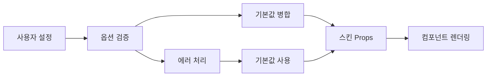

# ⚙️ 컴포넌트 옵션 참조

## 📋 목차
1. [옵션 시스템 개요](#옵션-시스템-개요)
2. [옵션 타입 정의](#옵션-타입-정의)
3. [컴포넌트별 옵션](#컴포넌트별-옵션)
4. [옵션 검증 및 기본값](#옵션-검증-및-기본값)
5. [동적 옵션 시스템](#동적-옵션-시스템)
6. [옵션 그룹화 및 카테고리](#옵션-그룹화-및-카테고리)

---

## 옵션 시스템 개요

WithCookie WebBuilder의 스킨 시스템은 **사용자 설정 가능한 옵션**을 통해 컴포넌트의 동작과 외관을 커스터마이징할 수 있습니다.

### 옵션의 역할

```typescript
// 옵션은 스킨 컴포넌트의 동작을 제어합니다
interface ComponentOption {
  name: string;              // 옵션 이름
  type: OptionType;          // 옵션 타입
  label: string;             // 사용자에게 표시될 라벨
  description?: string;      // 상세 설명
  default: any;              // 기본값
  required?: boolean;        // 필수 여부
  validation?: ValidationRule[]; // 유효성 검사 규칙
  group?: string;            // 옵션 그룹
  dependsOn?: string[];      // 종속성
  conditional?: ConditionalRule; // 조건부 표시
}
```

### 옵션 흐름



---

## 옵션 타입 정의

### 기본 옵션 타입

```typescript
type OptionType = 
  | 'text'           // 텍스트 입력
  | 'textarea'       // 여러줄 텍스트
  | 'number'         // 숫자 입력
  | 'boolean'        // 체크박스
  | 'select'         // 드롭다운 선택
  | 'multiselect'    // 다중 선택
  | 'color'          // 색상 선택
  | 'image'          // 이미지 업로드
  | 'file'           // 파일 업로드
  | 'date'           // 날짜 선택
  | 'datetime'       // 날짜/시간 선택
  | 'time'           // 시간 선택
  | 'url'            // URL 입력
  | 'email'          // 이메일 입력
  | 'password'       // 비밀번호 입력
  | 'range'          // 범위 슬라이더
  | 'json'           // JSON 객체
  | 'array'          // 배열
  | 'object'         // 객체
  | 'rich-text'      // 리치 텍스트 에디터
  | 'code'           // 코드 에디터
  | 'custom';        // 커스텀 입력
```

### 타입별 상세 설정

#### text 타입
```typescript
interface TextOption extends BaseOption {
  type: 'text';
  placeholder?: string;
  minLength?: number;
  maxLength?: number;
  pattern?: string;
  autocomplete?: string;
}

// 예시
const titleOption: TextOption = {
  name: 'title',
  type: 'text',
  label: '제목',
  description: '컴포넌트에 표시될 제목을 입력하세요',
  default: '기본 제목',
  placeholder: '제목을 입력하세요',
  maxLength: 100,
  required: true
};
```

#### select 타입
```typescript
interface SelectOption extends BaseOption {
  type: 'select';
  options: Array<{
    value: any;
    label: string;
    icon?: string;
    description?: string;
    disabled?: boolean;
  }>;
  multiple?: boolean;
}

// 예시
const styleOption: SelectOption = {
  name: 'style',
  type: 'select',
  label: '스타일',
  description: '컴포넌트의 시각적 스타일을 선택하세요',
  default: 'default',
  options: [
    { value: 'default', label: '기본' },
    { value: 'minimal', label: '미니멀', description: '깔끔한 디자인' },
    { value: 'card', label: '카드', description: '카드 형태 디자인' },
    { value: 'fullscreen', label: '전체화면', description: '전체 화면 레이아웃' }
  ]
};
```

#### number 타입
```typescript
interface NumberOption extends BaseOption {
  type: 'number';
  min?: number;
  max?: number;
  step?: number;
  unit?: string;
}

// 예시
const maxItemsOption: NumberOption = {
  name: 'maxItems',
  type: 'number',
  label: '최대 아이템 수',
  description: '한 번에 표시할 수 있는 최대 아이템 개수',
  default: 10,
  min: 1,
  max: 100,
  step: 1,
  unit: '개'
};
```

#### color 타입
```typescript
interface ColorOption extends BaseOption {
  type: 'color';
  format?: 'hex' | 'rgb' | 'rgba' | 'hsl' | 'hsla';
  alpha?: boolean;
  presets?: string[];
}

// 예시
const primaryColorOption: ColorOption = {
  name: 'primaryColor',
  type: 'color',
  label: '주요 색상',
  description: '컴포넌트의 주요 색상을 선택하세요',
  default: '#007bff',
  format: 'hex',
  alpha: false,
  presets: ['#007bff', '#28a745', '#dc3545', '#ffc107', '#6c757d']
};
```

#### image 타입
```typescript
interface ImageOption extends BaseOption {
  type: 'image';
  accept?: string;
  maxSize?: number;
  dimensions?: {
    minWidth?: number;
    minHeight?: number;
    maxWidth?: number;
    maxHeight?: number;
    aspectRatio?: number;
  };
  crop?: boolean;
}

// 예시
const logoOption: ImageOption = {
  name: 'logo',
  type: 'image',
  label: '로고 이미지',
  description: '브랜드 로고를 업로드하세요',
  default: null,
  accept: 'image/png,image/jpeg,image/svg+xml',
  maxSize: 2 * 1024 * 1024, // 2MB
  dimensions: {
    maxWidth: 500,
    maxHeight: 200,
    aspectRatio: 2.5
  },
  crop: true
};
```

#### array 타입
```typescript
interface ArrayOption extends BaseOption {
  type: 'array';
  itemType: OptionType;
  itemOptions?: Partial<ComponentOption>;
  minItems?: number;
  maxItems?: number;
  sortable?: boolean;
}

// 예시
const menuItemsOption: ArrayOption = {
  name: 'menuItems',
  type: 'array',
  label: '메뉴 아이템',
  description: '메뉴에 표시될 아이템들을 설정하세요',
  default: [],
  itemType: 'object',
  itemOptions: {
    properties: {
      label: { type: 'text', label: '라벨', required: true },
      url: { type: 'url', label: 'URL', required: true },
      icon: { type: 'text', label: '아이콘' }
    }
  },
  minItems: 1,
  maxItems: 10,
  sortable: true
};
```

---

## 컴포넌트별 옵션

### 로그인 컴포넌트

```typescript
const loginComponentOptions: ComponentOption[] = [
  // 기본 설정
  {
    name: 'title',
    type: 'text',
    label: '제목',
    description: '로그인 폼의 제목',
    default: '로그인',
    group: 'basic'
  },
  {
    name: 'subtitle',
    type: 'text',
    label: '부제목',
    description: '제목 아래에 표시될 부제목',
    default: '',
    group: 'basic'
  },
  
  // 스타일 설정
  {
    name: 'style',
    type: 'select',
    label: '스타일',
    description: '로그인 폼의 시각적 스타일',
    default: 'card',
    options: [
      { value: 'minimal', label: '미니멀' },
      { value: 'card', label: '카드' },
      { value: 'fullscreen', label: '전체화면' }
    ],
    group: 'appearance'
  },
  {
    name: 'primaryColor',
    type: 'color',
    label: '주요 색상',
    description: '버튼과 링크의 색상',
    default: '#007bff',
    group: 'appearance'
  },
  {
    name: 'brandLogo',
    type: 'image',
    label: '브랜드 로고',
    description: '로그인 폼 상단에 표시될 로고',
    default: null,
    accept: 'image/*',
    group: 'branding'
  },
  
  // 기능 설정
  {
    name: 'showSignupLink',
    type: 'boolean',
    label: '회원가입 링크 표시',
    description: '회원가입 페이지로 이동하는 링크를 표시합니다',
    default: true,
    group: 'features'
  },
  {
    name: 'showForgotPassword',
    type: 'boolean',
    label: '비밀번호 찾기 링크 표시',
    description: '비밀번호 찾기 페이지로 이동하는 링크를 표시합니다',
    default: true,
    group: 'features'
  },
  {
    name: 'showRememberMe',
    type: 'boolean',
    label: '로그인 유지 옵션 표시',
    description: '로그인 상태를 유지하는 체크박스를 표시합니다',
    default: false,
    group: 'features'
  },
  {
    name: 'enableSocialLogin',
    type: 'boolean',
    label: '소셜 로그인 활성화',
    description: '구글, 페이스북 등 소셜 로그인을 활성화합니다',
    default: false,
    group: 'features'
  },
  
  // 소셜 로그인 설정 (조건부)
  {
    name: 'socialProviders',
    type: 'multiselect',
    label: '소셜 로그인 제공자',
    description: '사용할 소셜 로그인 제공자를 선택하세요',
    default: [],
    options: [
      { value: 'google', label: 'Google' },
      { value: 'facebook', label: 'Facebook' },
      { value: 'twitter', label: 'Twitter' },
      { value: 'github', label: 'GitHub' },
      { value: 'kakao', label: 'KakaoTalk' },
      { value: 'naver', label: 'Naver' }
    ],
    conditional: {
      field: 'enableSocialLogin',
      operator: 'equals',
      value: true
    },
    group: 'features'
  },
  
  // 유효성 검사 설정
  {
    name: 'userIdValidation',
    type: 'object',
    label: '사용자 ID 유효성 검사',
    description: '사용자 ID 입력 필드의 유효성 검사 규칙',
    default: {
      required: true,
      minLength: 3,
      maxLength: 50,
      pattern: '^[a-zA-Z0-9_]+$'
    },
    properties: {
      required: { type: 'boolean', label: '필수 입력' },
      minLength: { type: 'number', label: '최소 길이', min: 1 },
      maxLength: { type: 'number', label: '최대 길이', max: 100 },
      pattern: { type: 'text', label: '정규식 패턴' }
    },
    group: 'validation'
  },
  
  // 고급 설정
  {
    name: 'redirectAfterLogin',
    type: 'url',
    label: '로그인 후 리다이렉트 URL',
    description: '로그인 성공 후 이동할 페이지 URL',
    default: '/',
    group: 'advanced'
  },
  {
    name: 'maxLoginAttempts',
    type: 'number',
    label: '최대 로그인 시도 횟수',
    description: '계정 잠금 전 허용되는 최대 실패 횟수',
    default: 5,
    min: 1,
    max: 10,
    group: 'security'
  },
  {
    name: 'sessionTimeout',
    type: 'number',
    label: '세션 타임아웃 (분)',
    description: '자동 로그아웃까지의 시간 (분)',
    default: 30,
    min: 5,
    max: 1440, // 24시간
    unit: '분',
    group: 'security'
  }
];
```

### 회원가입 컴포넌트

```typescript
const signupComponentOptions: ComponentOption[] = [
  // 기본 설정
  {
    name: 'title',
    type: 'text',
    label: '제목',
    default: '회원가입',
    group: 'basic'
  },
  {
    name: 'welcomeMessage',
    type: 'textarea',
    label: '환영 메시지',
    description: '회원가입 폼 상단에 표시될 환영 메시지',
    default: 'WithCookie에 오신 것을 환영합니다!',
    maxLength: 500,
    group: 'basic'
  },
  
  // 필드 설정
  {
    name: 'requiredFields',
    type: 'multiselect',
    label: '필수 입력 필드',
    description: '사용자가 반드시 입력해야 하는 필드들',
    default: ['username', 'email', 'password'],
    options: [
      { value: 'username', label: '사용자명' },
      { value: 'email', label: '이메일' },
      { value: 'password', label: '비밀번호' },
      { value: 'firstName', label: '이름' },
      { value: 'lastName', label: '성' },
      { value: 'phoneNumber', label: '전화번호' },
      { value: 'birthDate', label: '생년월일' },
      { value: 'address', label: '주소' }
    ],
    group: 'fields'
  },
  {
    name: 'optionalFields',
    type: 'multiselect',
    label: '선택 입력 필드',
    description: '사용자가 선택적으로 입력할 수 있는 필드들',
    default: ['firstName', 'lastName'],
    options: [
      { value: 'firstName', label: '이름' },
      { value: 'lastName', label: '성' },
      { value: 'phoneNumber', label: '전화번호' },
      { value: 'birthDate', label: '생년월일' },
      { value: 'address', label: '주소' },
      { value: 'company', label: '회사명' },
      { value: 'website', label: '웹사이트' }
    ],
    group: 'fields'
  },
  
  // 비밀번호 설정
  {
    name: 'passwordRequirements',
    type: 'object',
    label: '비밀번호 요구사항',
    description: '비밀번호가 만족해야 하는 조건들',
    default: {
      minLength: 8,
      requireUppercase: true,
      requireLowercase: true,
      requireNumbers: true,
      requireSymbols: false
    },
    properties: {
      minLength: { 
        type: 'number', 
        label: '최소 길이', 
        min: 6, 
        max: 32 
      },
      requireUppercase: { 
        type: 'boolean', 
        label: '대문자 포함' 
      },
      requireLowercase: { 
        type: 'boolean', 
        label: '소문자 포함' 
      },
      requireNumbers: { 
        type: 'boolean', 
        label: '숫자 포함' 
      },
      requireSymbols: { 
        type: 'boolean', 
        label: '특수문자 포함' 
      }
    },
    group: 'security'
  },
  {
    name: 'showPasswordStrength',
    type: 'boolean',
    label: '비밀번호 강도 표시',
    description: '입력한 비밀번호의 강도를 시각적으로 표시합니다',
    default: true,
    group: 'security'
  },
  
  // 약관 동의
  {
    name: 'termsAndConditions',
    type: 'object',
    label: '약관 동의 설정',
    description: '이용약관 및 개인정보처리방침 동의 설정',
    default: {
      required: true,
      termsUrl: '/terms',
      privacyUrl: '/privacy'
    },
    properties: {
      required: { 
        type: 'boolean', 
        label: '약관 동의 필수' 
      },
      termsUrl: { 
        type: 'url', 
        label: '이용약관 URL' 
      },
      privacyUrl: { 
        type: 'url', 
        label: '개인정보처리방침 URL' 
      }
    },
    group: 'legal'
  },
  {
    name: 'marketingConsent',
    type: 'object',
    label: '마케팅 동의 설정',
    description: '마케팅 정보 수신 동의 설정',
    default: {
      show: true,
      required: false,
      defaultValue: false
    },
    properties: {
      show: { 
        type: 'boolean', 
        label: '마케팅 동의 옵션 표시' 
      },
      required: { 
        type: 'boolean', 
        label: '마케팅 동의 필수' 
      },
      defaultValue: { 
        type: 'boolean', 
        label: '기본 선택 상태' 
      }
    },
    group: 'legal'
  },
  
  // 이메일 인증
  {
    name: 'emailVerification',
    type: 'object',
    label: '이메일 인증 설정',
    description: '회원가입 시 이메일 인증 관련 설정',
    default: {
      required: true,
      sendWelcomeEmail: true,
      verificationCodeLength: 6
    },
    properties: {
      required: { 
        type: 'boolean', 
        label: '이메일 인증 필수' 
      },
      sendWelcomeEmail: { 
        type: 'boolean', 
        label: '환영 이메일 발송' 
      },
      verificationCodeLength: { 
        type: 'number', 
        label: '인증 코드 길이',
        min: 4,
        max: 8
      }
    },
    group: 'verification'
  }
];
```

### 프로필 컴포넌트

```typescript
const profileComponentOptions: ComponentOption[] = [
  // 표시 설정
  {
    name: 'layout',
    type: 'select',
    label: '레이아웃',
    description: '프로필 정보의 표시 방식',
    default: 'tabs',
    options: [
      { value: 'single', label: '단일 페이지' },
      { value: 'tabs', label: '탭 형태' },
      { value: 'accordion', label: '아코디언' },
      { value: 'wizard', label: '단계별' }
    ],
    group: 'layout'
  },
  {
    name: 'showAvatar',
    type: 'boolean',
    label: '프로필 이미지 표시',
    description: '사용자 프로필 이미지를 표시합니다',
    default: true,
    group: 'display'
  },
  {
    name: 'avatarSize',
    type: 'select',
    label: '프로필 이미지 크기',
    description: '프로필 이미지의 크기를 선택하세요',
    default: 'medium',
    options: [
      { value: 'small', label: '작음 (64px)' },
      { value: 'medium', label: '보통 (128px)' },
      { value: 'large', label: '큼 (256px)' }
    ],
    conditional: {
      field: 'showAvatar',
      operator: 'equals',
      value: true
    },
    group: 'display'
  },
  
  // 편집 가능한 필드
  {
    name: 'editableFields',
    type: 'multiselect',
    label: '편집 가능한 필드',
    description: '사용자가 직접 편집할 수 있는 필드들',
    default: ['firstName', 'lastName', 'email', 'bio'],
    options: [
      { value: 'username', label: '사용자명' },
      { value: 'email', label: '이메일' },
      { value: 'firstName', label: '이름' },
      { value: 'lastName', label: '성' },
      { value: 'bio', label: '자기소개' },
      { value: 'phoneNumber', label: '전화번호' },
      { value: 'address', label: '주소' },
      { value: 'website', label: '웹사이트' },
      { value: 'socialLinks', label: '소셜 링크' }
    ],
    group: 'editing'
  },
  {
    name: 'readOnlyFields',
    type: 'multiselect',
    label: '읽기 전용 필드',
    description: '표시되지만 편집할 수 없는 필드들',
    default: ['createdAt', 'lastLoginAt'],
    options: [
      { value: 'id', label: '사용자 ID' },
      { value: 'createdAt', label: '가입일' },
      { value: 'lastLoginAt', label: '마지막 로그인' },
      { value: 'emailVerified', label: '이메일 인증 상태' },
      { value: 'accountStatus', label: '계정 상태' }
    ],
    group: 'editing'
  },
  
  // 보안 설정
  {
    name: 'enablePasswordChange',
    type: 'boolean',
    label: '비밀번호 변경 허용',
    description: '사용자가 비밀번호를 변경할 수 있도록 합니다',
    default: true,
    group: 'security'
  },
  {
    name: 'enable2FA',
    type: 'boolean',
    label: '2단계 인증 설정',
    description: '2단계 인증 설정 옵션을 표시합니다',
    default: false,
    group: 'security'
  },
  {
    name: 'showLoginHistory',
    type: 'boolean',
    label: '로그인 기록 표시',
    description: '최근 로그인 기록을 표시합니다',
    default: false,
    group: 'security'
  },
  
  // 개인정보 설정
  {
    name: 'privacySettings',
    type: 'object',
    label: '개인정보 설정',
    description: '개인정보 표시 및 공개 범위 설정',
    default: {
      showEmail: false,
      showPhoneNumber: false,
      showBirthDate: false,
      allowProfileSearch: true
    },
    properties: {
      showEmail: { 
        type: 'boolean', 
        label: '이메일 공개' 
      },
      showPhoneNumber: { 
        type: 'boolean', 
        label: '전화번호 공개' 
      },
      showBirthDate: { 
        type: 'boolean', 
        label: '생년월일 공개' 
      },
      allowProfileSearch: { 
        type: 'boolean', 
        label: '프로필 검색 허용' 
      }
    },
    group: 'privacy'
  }
];
```

---

## 옵션 검증 및 기본값

### 유효성 검사 규칙

```typescript
interface ValidationRule {
  type: 'required' | 'pattern' | 'min' | 'max' | 'custom';
  value?: any;
  message?: string;
  validator?: (value: any) => boolean | string;
}

// 유효성 검사 예시
const titleOption: ComponentOption = {
  name: 'title',
  type: 'text',
  label: '제목',
  default: '',
  validation: [
    {
      type: 'required',
      message: '제목은 필수 입력 항목입니다.'
    },
    {
      type: 'min',
      value: 1,
      message: '제목은 최소 1글자 이상이어야 합니다.'
    },
    {
      type: 'max',
      value: 100,
      message: '제목은 100글자를 초과할 수 없습니다.'
    },
    {
      type: 'pattern',
      value: '^[^<>]*$',
      message: '제목에 HTML 태그를 포함할 수 없습니다.'
    },
    {
      type: 'custom',
      validator: (value: string) => {
        if (value.includes('admin')) {
          return '제목에 "admin"을 포함할 수 없습니다.';
        }
        return true;
      }
    }
  ]
};
```

### 기본값 처리 시스템

```typescript
class OptionDefaultManager {
  // 기본값 병합 함수
  static mergeWithDefaults(
    userOptions: Record<string, any>,
    componentOptions: ComponentOption[]
  ): Record<string, any> {
    const merged: Record<string, any> = {};
    
    componentOptions.forEach(option => {
      const userValue = userOptions[option.name];
      
      // 사용자 값이 있고 유효하면 사용
      if (userValue !== undefined && this.validateOption(userValue, option)) {
        merged[option.name] = userValue;
      }
      // 없거나 유효하지 않으면 기본값 사용
      else {
        merged[option.name] = this.getDefaultValue(option);
      }
    });
    
    return merged;
  }
  
  // 기본값 계산 (동적 기본값 지원)
  static getDefaultValue(option: ComponentOption): any {
    const { default: defaultValue } = option;
    
    // 함수형 기본값
    if (typeof defaultValue === 'function') {
      return defaultValue();
    }
    
    // 객체 기본값 (깊은 복사)
    if (typeof defaultValue === 'object' && defaultValue !== null) {
      return JSON.parse(JSON.stringify(defaultValue));
    }
    
    // 원시값 기본값
    return defaultValue;
  }
  
  // 옵션 유효성 검사
  static validateOption(value: any, option: ComponentOption): boolean {
    if (!option.validation) return true;
    
    return option.validation.every(rule => {
      switch (rule.type) {
        case 'required':
          return value !== undefined && value !== null && value !== '';
          
        case 'pattern':
          return typeof value === 'string' && new RegExp(rule.value).test(value);
          
        case 'min':
          if (typeof value === 'number') return value >= rule.value;
          if (typeof value === 'string') return value.length >= rule.value;
          if (Array.isArray(value)) return value.length >= rule.value;
          return true;
          
        case 'max':
          if (typeof value === 'number') return value <= rule.value;
          if (typeof value === 'string') return value.length <= rule.value;
          if (Array.isArray(value)) return value.length <= rule.value;
          return true;
          
        case 'custom':
          return rule.validator ? rule.validator(value) === true : true;
          
        default:
          return true;
      }
    });
  }
}
```

---

## 동적 옵션 시스템

### 조건부 옵션 표시

```typescript
interface ConditionalRule {
  field: string;                                    // 참조할 옵션 필드명
  operator: 'equals' | 'not-equals' | 'in' | 'not-in' | 'greater' | 'less' | 'custom';
  value: any;                                       // 비교값
  customValidator?: (fieldValue: any, ruleValue: any) => boolean;
}

// 조건부 옵션 예시
const conditionalOptions: ComponentOption[] = [
  {
    name: 'enableNotifications',
    type: 'boolean',
    label: '알림 활성화',
    default: false
  },
  {
    name: 'notificationTypes',
    type: 'multiselect',
    label: '알림 유형',
    default: [],
    options: [
      { value: 'email', label: '이메일' },
      { value: 'sms', label: 'SMS' },
      { value: 'push', label: '푸시 알림' }
    ],
    conditional: {
      field: 'enableNotifications',
      operator: 'equals',
      value: true
    }
  },
  {
    name: 'emailSettings',
    type: 'object',
    label: '이메일 설정',
    default: {},
    conditional: {
      field: 'notificationTypes',
      operator: 'in',
      value: 'email'
    }
  }
];
```

### 종속성 관리

```typescript
interface OptionDependency {
  field: string;                    // 종속 대상 필드
  type: 'requires' | 'conflicts';  // 종속성 타입
  condition?: ConditionalRule;      // 종속 조건
}

// 종속성 있는 옵션 예시
const dependentOptions: ComponentOption[] = [
  {
    name: 'authType',
    type: 'select',
    label: '인증 방식',
    default: 'standard',
    options: [
      { value: 'standard', label: '표준 로그인' },
      { value: 'social', label: '소셜 로그인' },
      { value: 'sso', label: 'SSO' }
    ]
  },
  {
    name: 'socialProviders',
    type: 'multiselect',
    label: '소셜 제공자',
    default: [],
    dependsOn: ['authType'],
    conditional: {
      field: 'authType',
      operator: 'equals',
      value: 'social'
    }
  },
  {
    name: 'ssoConfig',
    type: 'object',
    label: 'SSO 설정',
    default: {},
    dependsOn: ['authType'],
    conditional: {
      field: 'authType',
      operator: 'equals',
      value: 'sso'
    }
  }
];
```

### 계산된 옵션 (Computed Options)

```typescript
interface ComputedOption extends ComponentOption {
  computed: true;
  calculator: (options: Record<string, any>) => any;
  dependsOn: string[];
}

// 계산된 옵션 예시
const computedOptions: ComputedOption[] = [
  {
    name: 'maxWidth',
    type: 'number',
    label: '최대 너비',
    default: 400,
    computed: true,
    dependsOn: ['containerWidth', 'padding'],
    calculator: (options) => {
      const { containerWidth = 1200, padding = 20 } = options;
      return Math.min(containerWidth - (padding * 2), 800);
    }
  },
  {
    name: 'gridColumns',
    type: 'number',
    label: '그리드 열 수',
    default: 3,
    computed: true,
    dependsOn: ['screenSize', 'itemWidth'],
    calculator: (options) => {
      const { screenSize = 'desktop', itemWidth = 200 } = options;
      const screenWidths = {
        mobile: 375,
        tablet: 768,
        desktop: 1200
      };
      return Math.floor(screenWidths[screenSize] / itemWidth);
    }
  }
];
```

---

## 옵션 그룹화 및 카테고리

### 옵션 그룹 정의

```typescript
interface OptionGroup {
  id: string;
  label: string;
  description?: string;
  icon?: string;
  order: number;
  collapsible?: boolean;
  defaultExpanded?: boolean;
}

const optionGroups: OptionGroup[] = [
  {
    id: 'basic',
    label: '기본 설정',
    description: '컴포넌트의 기본적인 설정들',
    icon: 'settings',
    order: 1,
    defaultExpanded: true
  },
  {
    id: 'appearance',
    label: '외관',
    description: '색상, 크기, 스타일 등 시각적 설정',
    icon: 'palette',
    order: 2,
    defaultExpanded: true
  },
  {
    id: 'behavior',
    label: '동작',
    description: '상호작용과 기능적 동작 설정',
    icon: 'mouse-pointer',
    order: 3,
    defaultExpanded: false
  },
  {
    id: 'advanced',
    label: '고급 설정',
    description: '개발자를 위한 고급 설정들',
    icon: 'code',
    order: 4,
    defaultExpanded: false
  },
  {
    id: 'security',
    label: '보안',
    description: '보안 관련 설정들',
    icon: 'shield',
    order: 5,
    defaultExpanded: false
  }
];
```

### 옵션 카테고리 시스템

```typescript
class OptionCategoryManager {
  // 그룹별로 옵션 분류
  static categorizeOptions(
    options: ComponentOption[],
    groups: OptionGroup[]
  ): Record<string, ComponentOption[]> {
    const categorized: Record<string, ComponentOption[]> = {};
    
    // 그룹 초기화
    groups.forEach(group => {
      categorized[group.id] = [];
    });
    
    // 그룹이 지정되지 않은 옵션들을 위한 기본 그룹
    categorized['ungrouped'] = [];
    
    // 옵션들을 그룹별로 분류
    options.forEach(option => {
      const groupId = option.group || 'ungrouped';
      if (categorized[groupId]) {
        categorized[groupId].push(option);
      } else {
        categorized['ungrouped'].push(option);
      }
    });
    
    return categorized;
  }
  
  // 조건부 옵션 필터링
  static filterConditionalOptions(
    options: ComponentOption[],
    currentValues: Record<string, any>
  ): ComponentOption[] {
    return options.filter(option => {
      if (!option.conditional) return true;
      
      const { field, operator, value } = option.conditional;
      const fieldValue = currentValues[field];
      
      switch (operator) {
        case 'equals':
          return fieldValue === value;
        case 'not-equals':
          return fieldValue !== value;
        case 'in':
          return Array.isArray(fieldValue) ? fieldValue.includes(value) : fieldValue === value;
        case 'not-in':
          return Array.isArray(fieldValue) ? !fieldValue.includes(value) : fieldValue !== value;
        case 'greater':
          return typeof fieldValue === 'number' && fieldValue > value;
        case 'less':
          return typeof fieldValue === 'number' && fieldValue < value;
        case 'custom':
          return option.conditional.customValidator 
            ? option.conditional.customValidator(fieldValue, value)
            : true;
        default:
          return true;
      }
    });
  }
}
```

### 옵션 레이아웃 시스템

```typescript
interface OptionLayout {
  type: 'grid' | 'list' | 'tabs' | 'accordion';
  columns?: number;
  spacing?: 'compact' | 'normal' | 'relaxed';
  showGroupTitles?: boolean;
  showDescriptions?: boolean;
}

// 옵션 렌더링 컴포넌트 예시
const OptionRenderer: React.FC<{
  options: ComponentOption[];
  groups: OptionGroup[];
  layout: OptionLayout;
  values: Record<string, any>;
  onChange: (name: string, value: any) => void;
}> = ({ options, groups, layout, values, onChange }) => {
  const categorizedOptions = OptionCategoryManager.categorizeOptions(options, groups);
  const visibleOptions = OptionCategoryManager.filterConditionalOptions(options, values);
  
  const renderOption = (option: ComponentOption) => {
    switch (option.type) {
      case 'text':
        return (
          <input
            type="text"
            value={values[option.name] || ''}
            onChange={(e) => onChange(option.name, e.target.value)}
            placeholder={option.placeholder}
          />
        );
      
      case 'select':
        return (
          <select
            value={values[option.name] || option.default}
            onChange={(e) => onChange(option.name, e.target.value)}
          >
            {option.options?.map(opt => (
              <option key={opt.value} value={opt.value}>
                {opt.label}
              </option>
            ))}
          </select>
        );
      
      case 'boolean':
        return (
          <input
            type="checkbox"
            checked={values[option.name] || false}
            onChange={(e) => onChange(option.name, e.target.checked)}
          />
        );
      
      // 다른 타입들...
      default:
        return <div>Unsupported option type: {option.type}</div>;
    }
  };
  
  return (
    <div className={`option-layout option-layout--${layout.type}`}>
      {groups.map(group => {
        const groupOptions = categorizedOptions[group.id]?.filter(option =>
          visibleOptions.includes(option)
        );
        
        if (!groupOptions?.length) return null;
        
        return (
          <div key={group.id} className="option-group">
            {layout.showGroupTitles && (
              <h3 className="option-group__title">
                {group.icon && <span className={`icon icon-${group.icon}`} />}
                {group.label}
              </h3>
            )}
            
            <div className="option-group__options">
              {groupOptions.map(option => (
                <div key={option.name} className="option-field">
                  <label className="option-field__label">
                    {option.label}
                    {option.required && <span className="required">*</span>}
                  </label>
                  
                  {layout.showDescriptions && option.description && (
                    <p className="option-field__description">
                      {option.description}
                    </p>
                  )}
                  
                  <div className="option-field__input">
                    {renderOption(option)}
                  </div>
                </div>
              ))}
            </div>
          </div>
        );
      })}
    </div>
  );
};
```

---

## 다음 단계

1. 📦 **[코드 예제](../examples/)** - 실제 동작하는 스킨 예제들
2. 🚀 **[배포 가이드](../deployment/)** - CDN 및 호스팅 옵션
3. ⚙️ **[운영 가이드](../operations/)** - 모니터링 및 관리

---

> **💡 핵심 포인트**: 컴포넌트 옵션 시스템은 **사용자 친화적인 커스터마이징, 타입 안전성, 확장성**을 모두 고려하여 설계되었습니다. 잘 구조화된 옵션 시스템을 통해 개발자와 사용자 모두에게 최적의 경험을 제공할 수 있습니다.